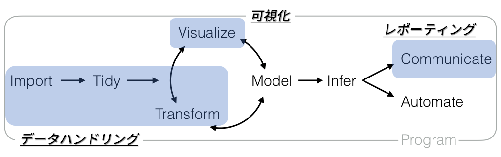
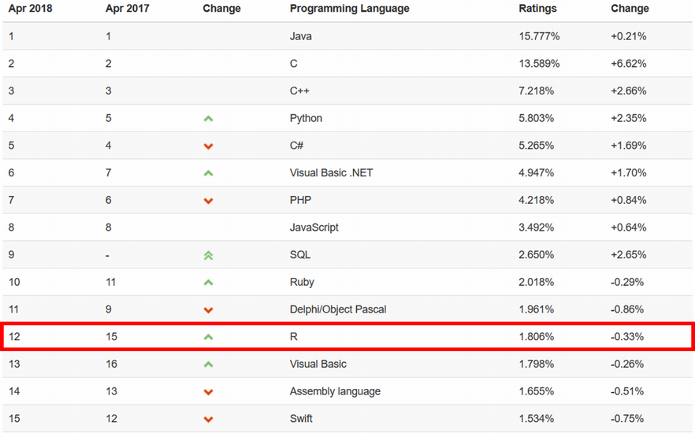
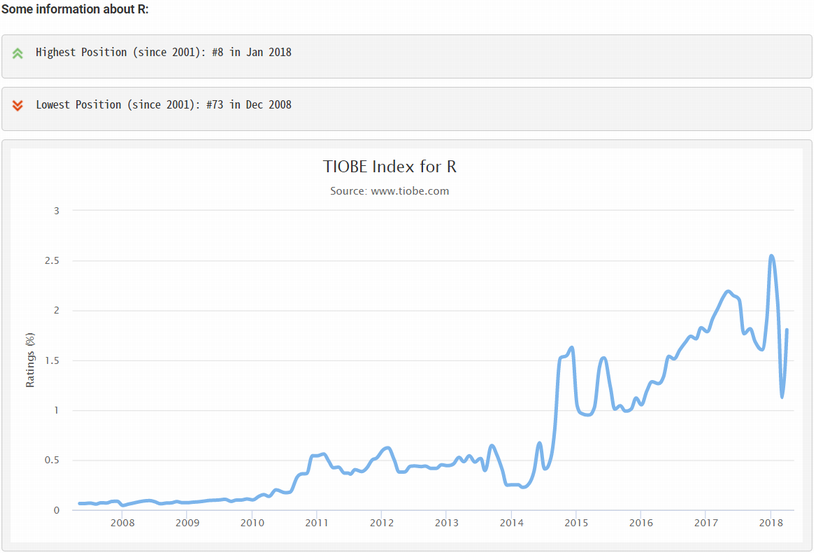
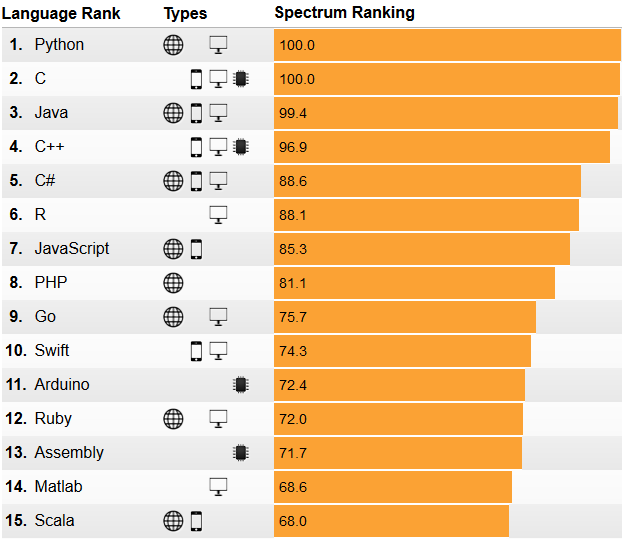
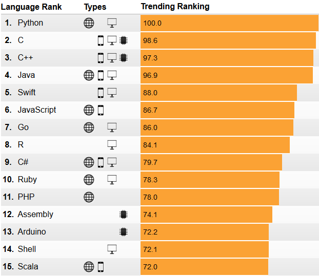
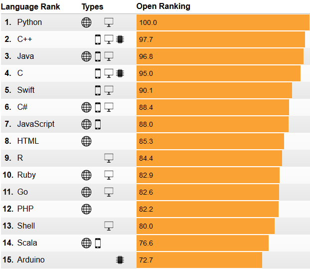
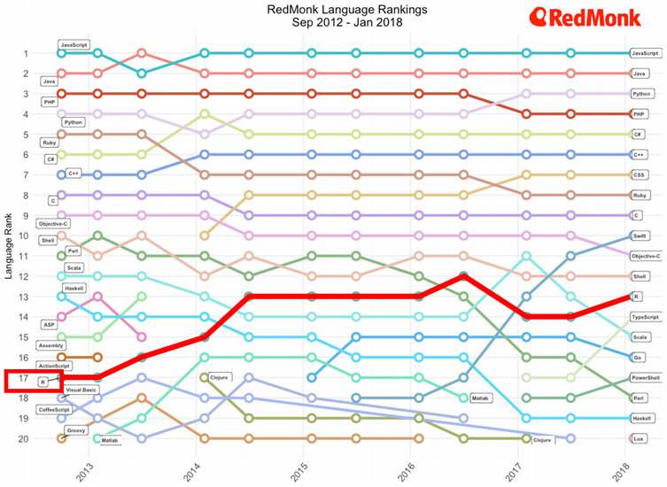
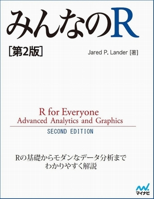

```{r setup, include=FALSE}
knitr::opts_chunk$set(echo = TRUE, message = FALSE)

require(tidyverse)
```

# その前に

## 今年度のテーマと目標
　　**テーマ**：実践データ分析　～実務での利用を目指して～  
　　**目　標**：分析に関わる基本的なスキルを伸ばす・習得する



# なぜRなのか？

## [Six Reasons To Learn R For Business, R Blogger](https://www.r-bloggers.com/six-reasons-to-learn-r-for-business/){target="_blank"}

1. R Has The Best Overall Qualities
1. R Is Data Science For Non-Computer Scientists
1. Learning R Is Easy With The Tidyverse
    * Structured Programming Interface
1. R Has Brains, Muscle, And Heart
    * Cutting-edge algorithms and Powerful tools (packages)
1. R Is Built For Business
    * R Markdown
1. R Community Support

<!-- [original](http://www.business-science.io/business/2017/12/27/six-reasons-to-use-R-for-business.html){target="_blank"} -->

---



---



---



---



---



---



## 推奨図書
著者が学生ならこういうことを教わりたかったという視点で解説しているらしい。Rの基礎から一通り知りたい場合に向いています。第2版はモダンなデータ分析と言われる"Tidyverse"の解説が追加されているので買うなら第2版。



## 推奨図書
R Markdownによる再現可能なデータ分析とレポート作成の解説に加えてRStudio自体の解説もある今までのR関連書籍とは毛色の異なる（個人的には）待望の書籍。


## License
本資料中で引用してる画像などの著作権は各著作権者にあります。