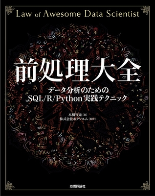
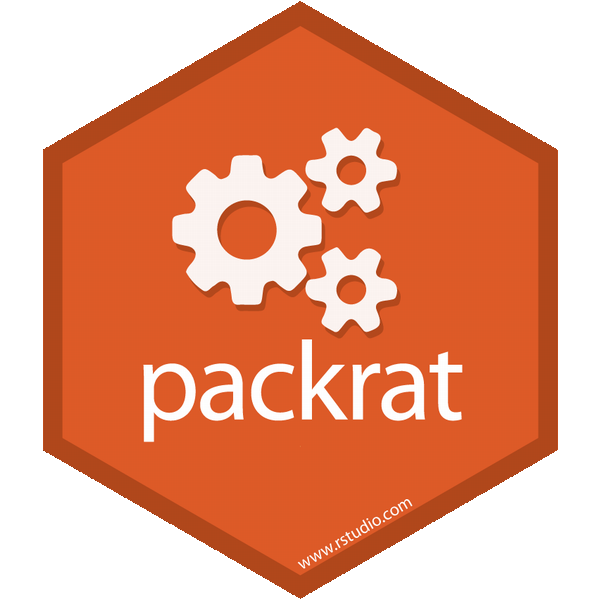

```{r setup, include=FALSE}
knitr::opts_chunk$set(echo = TRUE, message = FALSE)

require(tidyverse)
```

## 本勉強会について
2011年度に小池氏が発足させたR勉強会を母体とするソフトウェアメトリクス分析に興味・関心がある**有志による**勉強会です。詳細は[こちら](https://sites.google.com/site/kantometrics/home)。

　     | メンバーなど                   | 備考
-------|--------------------------------|------------------------
主　催 | 小池                           | SQiP研究会運営委員長・演習コースII 主査
事務局 | 河野、中嶋、野田、松田、鈴木他 | 
会　場 | TIS株式会社（bit & innovation他）| 福田氏のご尽力に多謝

　  
発足の経緯から既参加メンバーはSQiP研究会参加者が多いですが、SQiP研究会への参加の有無に関わらず**広く門戸を開いています**。

## データ分析とは
何らかの目的を持って表現された文字や符号、数値などを収集し、分類、整理、成型、取捨選択したうえで解釈して、価値のある意味を見出すことといえるでしょう。（中略）そのために以下の3つを理解しておく必要があります。  

1) 分析しようとする問題そのものについての理解
1) 分析手法についての理解
1) 分析結果に対する判断力

<p align=right>出典：[データ分析とは <i class="fa fa-external-link"></i>](https://www.albert2005.co.jp/knowledge/statistics_analysis/statistics_basics/data_analysis){target="_blank" title="データ分析基礎知識"}</p>  

データ分析を行うためは分析ツールが必要不可欠で、その使い方を知っているのと知らないのでは分析効率や**再現性確保に差**が生じます。特にソフトウェアメトリクス分析のようなアドホック分析ではその差が顕著に出ると思います。

## 参考）アドホック分析
アドホック（ad hoc）は「特定の」、「特別の」、「限定された目的の」というようなことを意味する言葉です。データ分析においてアドホック分析という場合

<center>（分析から）**得られた知見に基づき改善提案などを行うための分析**</center>  
　  
というような意味で使われることが多いです。この場合、分析はオフラインで行われることが多くリアルタイムで処理する必要もありません。ソフトウェアメトリクス分析の場合、まさにこのアドホック分析といえます。  
　  
一方、最近流行りのデータサイエンティストと言われる方々はAmazonやGoogleの例を見ても分かるようデータをオンライン、リアルタイムで処理するためのアルゴリズム開発・実装を行うのが主といえます。  
　  
参考： [データサイエンティストは「アルゴリズム実装系」と「アドホック分析系」とに分けた方が良いかも](https://tjo.hatenablog.com/entry/2013/08/01/200702)

## 今年度のテーマと目標
　　テーマ：実践データ分析　～実務での利用を目指して～  
　　目　標：分析に関わる基本的なスキルを伸ばす・習得する

](./fig/dswf.png)

# なぜRを使うのか？

## [Six Reasons To Learn R For Business, R Blogger](https://www.r-bloggers.com/six-reasons-to-learn-r-for-business/){target="_blank"}

1. R Has The Best **Overall Qualities**
1. R Is Data Science **For Non-Computer Scientists**
1. Learning R Is **Easy With The Tidyverse**
    * Structured Programming Interface
1. R Has **Brains, Muscle, And Heart**
    * Cutting-edge algorithms and Powerful tools (packages)
1. R Is Built **For Business**
    * R Markdown
1. R Community Support

<!-- [original](http://www.business-science.io/business/2017/12/27/six-reasons-to-use-R-for-business.html){target="_blank"} -->

---

](./fig/TIOBE_index_201804.png)

---

](./fig/TIOBE_index_R_201804.png)

---

](./fig/IEEE_Spectrum_Ranking_2017.png)

---

](./fig/IEEE_Trending_Ranking_2017.png)

---

](./fig/IEEE_Open_Source_Hubs_Ranking_2017.png)

---

](./fig/redmonklang.png)

---

](./fig/redmonklangrankings.png)


## 推奨図書：『みんなのR 第2版』
著者（統計学の教授）が学生ならこういうことを教わりたかったという視点で解説していて基礎から一通り学ぶ場合に向いています。トレンドの"Tidyverse"の解説が追加された**第2版**がおすゝめ。第1版欲しいなら半額で譲ります！


## 推奨図書：『再現可能性のすゝめ』
R Markdownによる再現可能なデータ分析とレポート作成の解説に加えRStudio自体の解説もあり今までのR関連書籍とは毛色が異なるが、**これからRを使う人に**も[おすゝめ（by 著者）](https://qiita.com/kohske/items/3e8c02e9598c6d230a47)。


## 推奨図書：『前処理大全』
データ分析の8割、9割はデータを整えるための前処理に費やされると言われており、この前処理を効率的にこなすことで本来実施したい分析に時間を割くことができるようになります。**マエショリスト必読**の書。




## GitとGitHub
Gitは分散型VCS(Version Control System)。GitHubはクラウドサービス。


## R Package "Packrat"
`packrat`はRのパッケージ管理を行うためのパッケージ。



## License

CC BY-NC-SA 4.0, Sampo Suzuki  

* 本資料中で引用してる画像などの著作権は原著作権者にあります。

# Enjoy!