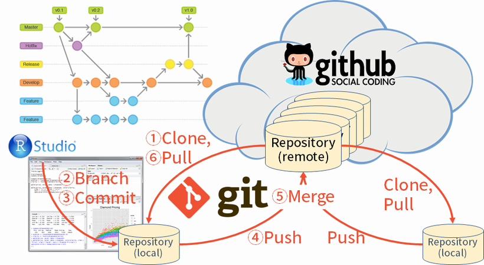

```{r setup, include=FALSE}
knitr::opts_chunk$set(echo = TRUE, message = FALSE)

require(tidyverse)
```

## 勉強会について
2011年度に主催である小池氏が発足させたR勉強会を母体とするソフトウェアメトリクス分析に興味・関心がある有志による**勉強会**です。詳細は[こちら](https://sites.google.com/site/kantometrics/home)。

　     | メンバー                       | 備考
-------|--------------------------------|------------------------
主　催 | 小池                           | SQiP研究会委員長・主査
事務局 | 河野、中嶋、野田、武田、鈴木他 | 
協　力 | TIS株式会社                    | 会場無償提供

## 今年度のテーマと目標
　　テーマ：実践データ分析　～実務での利用を目指して～  
　　目　標：分析に関わる基本的なスキルを伸ばす・習得する


# なぜRを使うのか？

## [Six Reasons To Learn R For Business, R Blogger](https://www.r-bloggers.com/six-reasons-to-learn-r-for-business/){target="_blank"}

1. R Has The Best **Overall Qualities**
1. R Is Data Science **For Non-Computer Scientists**
1. Learning R Is **Easy With The Tidyverse**
    * Structured Programming Interface
1. R Has **Brains, Muscle, And Heart**
    * Cutting-edge algorithms and Powerful tools (packages)
1. R Is Built **For Business**
    * R Markdown
1. R Community Support

<!-- [original](http://www.business-science.io/business/2017/12/27/six-reasons-to-use-R-for-business.html){target="_blank"} -->

---


---


---


---


---


---


## 推奨図書
著者が学生ならこういうことを教わりたかったという視点で解説しているので基礎から一通り学ぶ場合に向いています。モダンなデータ分析と言われる"Tidyverse"の解説が追加された**第2版を買うべき**。


## 推奨図書
R Markdownによる再現可能なデータ分析とレポート作成の解説に加えてRStudio自体の解説もある今までのR関連書籍とは毛色の異なる（個人的には）**待望の書**。


## [FYI] GitとGitHub
Gitは分散型VCS(Version Control System)。GitHubはクラウドサービス。



## License
本資料中で引用してる画像などの著作権は各著作権者にあります。