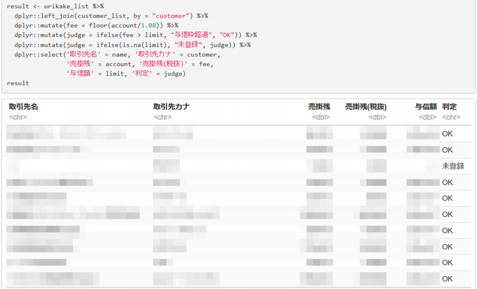
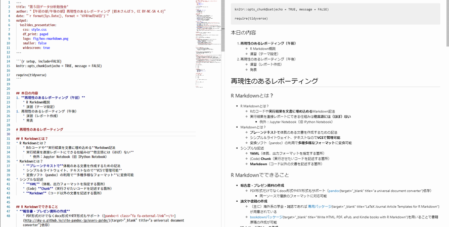

```{r setup, include=FALSE}
knitr::opts_chunk$set(echo = TRUE, message = FALSE)

require(tidyverse)
```


## 本日の内容
1. **再現性のあるレポーティング（午前）**
    * R Markdown概説
    * 演習（テーマ設定）
1. 再現性のあるレポーティング（午後）
    * 演習（レポート作成）
    * 発表

# 再現性のあるレポーティング


## 再現性とは？
* **データから分析結果が再現できる**こと
    * 再現可能性（Reproducibility）ともいわれる
    * [CRAN Taskの一つ<i class="fa fa-external-link"></i>](https://cran.r-project.org/web/views/ReproducibleResearch.html){target="_blank" title="Reproducible Research"}

　  

* 同じデータから同じ結果が得られることは科学的知見の蓄積において重要
    * 出典： [統計解析の再現可能性を高める取り組み<i class="fa fa-external-link"></i>](https://www.slideshare.net/YoshihikoKunisato/ss-77835559){target="_blank" title="P7 なぜ再生可能性を高めるか？"}
* 過去の分析を見直した時に何をやっているか理解できることも重要
    * その場限りの分析では知見の蓄積にならない
* 文書化（記録）されない**手作業（データ整形、コピペなど）が再現性を阻害**する
    * 人の記憶は絶対じゃない


## 再現可能性を確保するには
* 分析作業と文書化が同時に行える仕組みを利用する
    * この仕組みが**R Markdown**

　  

* R Markdownを使うと
    * **再現可能性**の確保
        * 常に同じ結果が得られる
    * **作業効率**の向上
        * 分析作業とレポーティングが同時進行
    * **リバイズ（revise）対応**が容易
        * 追加分析や別データでの分析など


## R Markdownとは？
* Rのコードや**実行結果を文書に埋め込める**Markdown記法
* 実行結果を直接レポートにできる仕組みは**他言語には（ほぼ）ない**
    * 例外：Jupyter Notebook（旧 IPython Notebook）
* Markdownとは？
    * **プレーンテキストで**体裁のある文書を作成するための記法
    * シンプル＆ライトウェイト、テキストなので**VCSで管理可能**
    * 変換ソフト（pandocなど）の利用で**多種多様なフォーマット**に変換可能
* シンプルな記述
    * **YAML**（体裁、出力フォーマットを指定する箇所）
    * (Code) **Chunk**（実行させたいコードを記述する箇所）
    * **Markdown**（コード以外の文書を記述する箇所）


## R Markdownでできること
* **報告書・プレゼン資料の作成**
    * PDF形式だけでなくdocx形式やRTF形式もサポート（[pandoc<i class="fa fa-external-link"></i>](http://sky-y.github.io/site-pandoc-jp/users-guide/){target="_blank" title="a universal document converter"}依存）
        * 同一ソースで複数のフォーマットに対応可能
* **論文や書籍の作成**
    * （主に）海外系の学会・雑誌であれば [専用パッケージ<i class="fa fa-external-link"></i>](https://github.com/rstudio/rticles){target="_blank" title="LaTeX Journal Article Templates for R Markdown"}が用意されている
    * [bookdownパッケージ<i class="fa fa-external-link"></i>](https://bookdown.org/home/){target="_blank" title="Write HTML, PDF, ePub, and Kindle books with R Markdown"}を用いることで書籍原稿の作成が可能
* **Webページやblogの作成**
    * R Markdown Web Site機能が標準装備（今回のサイトはこれで作成）
    * [blogdownパッケージ<i class="fa fa-external-link"></i>](https://bookdown.org/yihui/blogdown/){target="_blank" title="blogdown"}を用いることでblogも作成可能
* その他
    * データの俯瞰に便利な[ダッシュボード<i class="fa fa-external-link"></i>](https://rmarkdown.rstudio.com/flexdashboard/examples.html){target="_blank" title="flexdashboard"}を作成可能


## 業務での利用例



## R以外の言語にも対応
当然、使用する言語がインストールされていることが前提ですが、これだけの言語がChunkで使えます。
```{r}
names(knitr::knit_engines$get())
```

RStudio v1.2からR言語以外の言語サポート、特にPythonのサポートが強化されるらしい。


## R Markdown Basics
* [R Markdown Basics](https://k-metrics.github.io/cabinet/communicate/rmd_basics.html)
    * YAML（体裁、出力フォーマットを指定する箇所）
        * YAML Ain't Markup Language
        * 構造化データなどを文字列にシリアライズ（直列化）するための形式
    * (Code) Chunk（コードを記述する箇所）
        * **R Markdown特有**の記述
        * 様々な言語による実行コードの記述・実行と実行制御が可能
    * Markdown（コード以外の文書を記述する箇所）
        * 軽量マークアップ言語（マークアップ言語：HTML, XMLなど）
        * [GitHub Flavored Markdown<i class="fa fa-external-link"></i>](https://guides.github.com/features/mastering-markdown/#GitHub-flavored-markdown){target="_blank" title="Mastering Markdown, GitHub Guides"}などの方言多数


## Preview Editor
R Markdownをプレビューしながら編集したい場合は、Microsftの [Visual Studio Code<i class="fa fa-external-link"></i>](https://code.visualstudio.com/){target="_blank" title=""}が便利



# 演習


## 演習（テーマ設定）について
* チームごとに何をレポートするかのテーマを設定します
* 設定したテーマに対してR Markdownでレポートを作成します
    * テーマやデータに対して特に制限は設けません（常識的な範囲で）
    * フォーマットはHTMLであればドキュメント形式プレゼン形式を問いません
        * 勉強会サイトで公開できるように


### テーマ例
* 書籍とかには掲載されていない分布表を作ってみる（自由度の高いt分布表）
* デート本、ＳＭ本、統計学基礎の例題や問題を解いてみる
* Redmineチケットや政府統計を可視化したり仮説検定したりしてみる
* K-POPの何かの相関を分析してみる


## オープンデータの例
* [e-Stat<i class="fa fa-external-link"></i>](https://www.e-stat.go.jp/){target="_blank" title="政府統計の総合窓口"}
* [過去の気象データ・ダウンロード<i class="fa fa-external-link"></i>](https://www.data.jma.go.jp/gmd/risk/obsdl/index.php){target="_blank" title="気象庁"}
    * 1872年からの観測データ。気温の他に日照/日射、雲量/天気などのデータがダウンロード可能。ただし、ダウンロードできるデータ量に制限があるので必要に応じて分割してダウンロードする必要があります。
* [データカタログサイト<i class="fa fa-external-link"></i>](http://www.data.go.jp/){target="_blank" title="DATA.GO.JP"}
* [統計データ分析コンペティション<i class="fa fa-external-link"></i>](https://www.nstac.go.jp/statcompe/){target="_blank" title="教育用標準データセット"}
    * e-Stat（総務省統計局）に収録されている「都道府県・市区町村のすがた（社会・人口統計体系）」の市区町村データから約100項目余を抜き出し、縦に市区町村、横にデータ項目が並ぶ表形式のデータに整備したもの。（当該ページより一部抜粋）
* [統計解析に使えるデータセットまとめ<i class="fa fa-external-link"></i>](http://hoxo-m.hatenablog.com/entry/20120214/p1){target="_blank" title="ほくそ笑む"}
* 今回は**スクレイピング禁止**（スクレイピングは攻撃と見なされる可能性があり施設側に迷惑がかかるため）


## チーム分け（仮）

チーム | リーダ | メンバー
-------|--------|-------------
A      | Ka   | 
B      | Fu   | 
C      | Ma   | 
D      | No   | 
E      | Na   | 


## 本日の内容
1. 再現性のあるレポーティング（午前）
    * R Markdown概説
    * レポーティング課題設定
1. **再現性のあるレポーティング（午後）**
    * レポート作成
    * 発表


# 再現性のあるレポーティング

## 演習（レポート作成）

チーム | リーダ | レポートテーマ
-------|--------|-------------
A      | Ka   | 
B      | Fu   | 
C      | Ma   | 
D      | No   | 
E      | Na   | 
　  

* 不明点などは適宜、相談するか質問してください


## 発表

チーム | 発表者 | レポートテーマ
-------|--------|-------------
A      |    | 
B      |    | 
C      |    | 
D      |    | 
E      |    | 


## License

CC BY-NC-SA 4.0, Sampo Suzuki