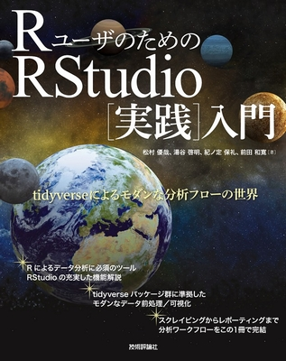
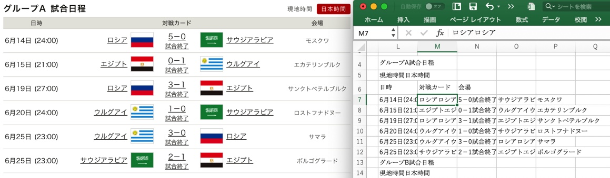
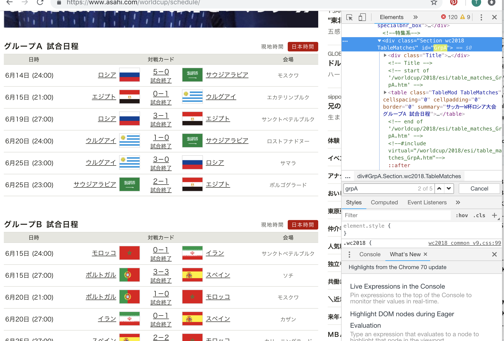

```{r setup, include=FALSE}
knitr::opts_chunk$set(echo = TRUE, message = FALSE)

require(rvest)
require(xml2)
require(tidyverse)

# [RStudio で日本語が使えなくなっていた](https://blog.goo.ne.jp/r-de-r/e/084639aec24beb8a6d08b8241545ef1a)
# Sys.setlocale("LC_ALL", "ja_JP.UTF-8")
```

## 今日のゴール

* Rでスクレイピングできるようになる
* 今年度学んできたtidyverseな世界をモノにする
* 現場で実践できるようになる（**試したくなる**）

## 本日の内容

* データインポート ハンズオン
    - スクレイピングとは？
    - メリットと注意事項
    - ハンズオン

* 演習
    - 班ごとにテーマ設定
    - スクレイピングを含む総合演習に挑戦
    - 成果発表

# スクレイピング

## スクレイピングとは？

* Web上の情報をプログラミングコードで取得すること
* Webサイトの情報のうち、欲しい部分だけを抽出する技術のこと

```{r}
"https://www.asahi.com/worldcup/schedule/" %>% 
  read_html() %>% 
  html_node(xpath = '//*[@id="GrpA"]/table') %>% 
  html_table()
```


参考：[Google 先生に聞いても意外とわからなかったウェブスクレイピング基礎編](https://www.fascinatedwithtofu.com/2017/01/08/scraping1/)


## 推奨図書
通称『宇宙本』。RStudioを使ってスクレイピングからレポーティングまでを網羅した一冊。今年度勉強会での[基本的な内容をほぼ網羅 <i class="fa fa-external-link"></i>](https://pbs.twimg.com/media/DhZF9pFW0AMjUME.jpg:large){target="_blank" title="Twitter"}している。（[技術評論社 <i class="fa fa-external-link"></i>](http://gihyo.jp/book/2018/978-4-7741-9853-8){target="_blank" title="RユーザのためのRStudio［実践］入門"}）




## Data Science Workflow での位置付け
スクレイピングは、**Import** に位置付けられる。

データソースから直接取り込むという点で、Import の更に前段も含んでいるという解釈も可能。

](./fig/dswf.png)


## Rでスクレイピングするメリット {.smaller}

* 解析、可視化をスクリプト化しても、ソースが変わってしまったら再現可能でない

「素晴らしいじゃないか、ジョン。ところで以前渡したデータには間違いがあったんだ。」

* Redmine, バグ管理システム等、Web上で管理されていることが多い
* それらの集計機能では痒いところに手が届かず、ウンザリしちゃう
* 毎日変動するデータを分析したければ、ダウンロードだけでも煩わしい
* Rでも意外と簡単にスクレイピングできちゃう

引用：「Wonderful R 3 再現可能性のすゝめ」（共立出版）


## Excelを経由することの弊害

* 更新の度にダウンロードして、保存する必要がある
* 体裁を整える必要がある、もしくは整えたくなる
    - 列が結合されている
    - 繰り返し必要なデータが入っていない
* 試行錯誤やデータの解釈・判断が入り込み得る

**手作業が発生した時点で、その後のプロセスの再現可能性は破綻している**




## やってみよう ・・・その前に

スクレイピングする際には以下に気をつけましょう

* 規約でスクレイピングを禁止していないか？（ツイッター等）

 → API等を利用しよう

* 著作権等に抵触しないか？

 → 対象データ、用途、公開先を適切に

* 相手サーバーから攻撃とみなされないか？

 → 繰り返し処理で取得する場合は、Sleepする

**基本的には自己責任です！**

## 前提として必要となる用語

* HTML : HyperText Markup Language
* DOM  : Document Object Model

HTMLの要素を樹木のような階層構造に変換したもの

* CSS  : Cascading Style Sheets

HTML内のスタイル（文字の色や大きさなど）を定義する。

* XML  : eXtensible Markup Language
* XPath : XML Path Language

今日の目的では深く知る必要はありませんが、**免疫をつけてください。**


## Chromeデベロッパーツール

* 対象サイトの調査に、Chromeのデベロッパーツールを使います。
* 他のブラウザでも同様のツールがある（ようです）。
* 表示 > 開発/管理 > デベロッパーツール（option + command + i）




## HTML

* タグ、<開始タグ>、</終了タグ>、要素、入れ子構造
* 代表的なタグ、head,div,a,p
* 属性, href, id, class

```{r eval=FALSE}
<html>
  <head>
    <title>タイトル</title>
  </head>
  <body>
    <h1>大見出し</h1>
    <a href="http://hogehoge.jp/" target="_blank">ほげほげ</a>
    <p class="green">classを使った例</p>
    <p id="red">idを使った例</p>
  </body>
</html>
```

## CSS {.smaller}

* HTML内の特定の部分の文字の色や大きさ、行間、余白などの情報を与える
* HTML内にも記述できるが、CSSファイルを分けて用意する場合が多い
* CSSセレクタを用いることで、HTML内の特定の要素にアクセスできる
* '>' によって入れ子構造を表現できる "html > head > title"
* class, id属性による指定

Selectors Level 3 (W3C): https://www.w3.org/TR/css3-selectors/

```{r eval=FALSE, size=3}
h1 {
  font-style: italic;
  background: yellow;
}

p.green {
  color:  green;
}

p#red {
  border: 1px solid;
  color:  red;
}
```

## XML と XPath

* HTMLと似ているが、独自にタグを定義できる
* データを構造的に記録する

* XMLの特定の要素にアクセスできるのが XPath
* HTMLの要素にもアクセスできる
* '/' によって入れ子構造を表現できる
* class, id属性による指定

XML Path Language 3.1 (W3C): https://www.w3.org/TR/xpath/

**スクレイピングでは、CSSセレクタかXPathを使ってHTMLの要素にアクセスする**


## Chromeデベロッパーツール つづき

* Elementsタブでノードをポイントすると、該当箇所がハイライトされる。
* サイト上で右クリック→「検証」とすると、該当ノードにフォーカスする。
* ツール左上の押下後にサイト上で指定しても同じ。
* Elementsタブでノードを右クリックしてCSSセレクタ、XPathをコピーする。

[サルワカ - 初心者向け！Chromeの検証機能（デベロッパーツール）の使い方](https://saruwakakun.com/html-css/basic/chrome-dev-tool)

[Qiita - Chrome デベロッパーツールの使い方まとめ](https://qiita.com/d-dai/items/0b580b26bb1d1622eb46)


# rvestでスクレイピング

## rvest パッケージ

* Rでスクレイピングするための代表的なツール
* install.package("tidyverse") で一緒にインストールされる
* library(tidyverse) で自動的に読み込まれるパッケージには含まれていない

```{r}
library(rvest)
```


## read_html

* HTMLをガサーっと読み込む。
* URLを指定するだけ。
* 実際には、DOM形式に変換して保存する。

```{r}
"https://www.asahi.com/worldcup/schedule/" %>% 
  read_html()
```
```{r include=FALSE}
content <- "https://www.asahi.com/worldcup/schedule/" %>% 
  read_html() %>% 
  html_node(xpath = '/html/head/meta[2]') %>% 
  html_attr("content") %>% 
  strsplit("; ")

"https://www.asahi.com/worldcup/schedule/" %>% 
  read_html() %>% 
  html_node(xpath = "//meta[@content | @charset]") %>% 
  magrittr::extract(2)


charset <- content[[1]][2] %>% 
  strsplit("=")

charset <- charset[[1]][2]
charset

```

## html_nodes, html_node

* 読み込んだURLから指定の要素（ノード）を抽出する。
* CSSセレクタでの指定、XPathでの指定の２通りある。
* 階層の深いノードにアクセスしたいときは、XPathによる指定が安全（らしい）
* XPath内でクォーテーションを使用している場合、シングルとダブルで区別できるようにすること。
* 下の例では、「IDが"GrpA"であるテーブル」にアクセスしている。

```{r}
"https://www.asahi.com/worldcup/schedule/" %>% 
  read_html() %>% 
  html_node(xpath = '//*[@id="GrpA"]/table')
```

## html_text

* 指定した要素（ノード）から、テキストデータを抽出する。

```{r}
"https://www.asahi.com/worldcup/schedule/" %>% 
  read_html() %>% 
  html_node(css = "title") %>% 
  html_text()

```

## html_table

* 表データを取得し、データフレーム形式に変換する。

```{r}
"https://www.asahi.com/worldcup/schedule/" %>% 
  read_html() %>% 
  html_node(xpath = '//*[@id="GrpA"]/table') %>% 
  html_table()
```

## html_attrs, html_attr

* 属性を取得する
* 単数形の関数では引数に属性を指定、属性の値だけ取り出される
* 2つ目のURLだけ必要なら、magrittr::extract(2)が便利

```{r eval=FALSE}
zip_url = page %>%
  html_nodes("a") %>%   ## find all links
  html_attr("href") %>% ## pull out url
  str_subset("\\.zip")  ## pull out zip links
```
参考：[特殊講義「インターネットを活用した経済データの分析」](http://cfes-project.eco.u-toyama.ac.jp/wp-content/uploads/2017/04/3_scraping.html)

## その他

関数             | 用途       
:---------------:|:----------:
past0            | URLの切り貼りに
strsplit         | セパレータを指定して、文字列を分割する
for              | 複数のページから取得
Sys.sleep        | 繰り返しアクセスする場合に間を空ける
dplyr::mutate    | データ型の指定など
dplyr::bind_rows | 複数ページから取得したデータを連結する


[Appendix.A:【補足】文字列操作](./07_guidance_appendixA.html)


## ログインが必要な場合
1. ログイン状態のセッションを作る

```{r eval=FALSE}
login_page <- html_session("http://hogehoge/redmine/login")

login_form <- html_form(login_page)[[1]] %>% 
 set_values(username="Kato", password="xxxxxxxxx")

session <- submit_form(login_page, login_form) 
```

参考：[Qiita - rvest でログインしてスクレイピング](https://qiita.com/hoxo_m/items/59bedbf7e4c7c99cbf5a)

## ログインが必要な場合
2. セッション上でスクレイピング

```{r eval=FALSE}

session %>% 
 jump_to("http://hogehoge/redmine/projects/prj-fugafuga/time_entries") %>% 
 read_html() %>% 
 html_node(xpath='//*[@id="content"]/form[2]/div[2]/table') %>% 
 html_table()
```


プロジェクト  | 日付       | ユーザー  | 活動       | チケット        | 時間
:------------:|:----------:|:---------:|:----------:|:---------------:|:----:
プロジェクトA | 2018/09/13 | ほげほげ  | テスト実施 | #6685: NERF0618 | 11.0
プロジェクトA | 2018/09/13 | ほげほげ  | テスト実施 | #6693: NERF0628 | 7.5
プロジェクトA | 2018/09/12 | ぼけぼけ  | テスト実施 | #6688: NERF0622 | 5.0
プロジェクトA | 2018/09/11 | 加藤 拓海 | レビュー   | #6692: NERF0627 | 0.5
プロジェクトA | 2018/09/11 | ぼけぼけ  | テスト実施 | #6688: NERF0622 | 4.0
プロジェクトA | 2018/09/10 | ほげほげ  | テスト実施 | #6689: NERF0624 | 6.5
プロジェクトA | 2018/09/10 | ほげほげ  | テスト実施 | #6692: NERF0627 | 3.0
プロジェクトA | 2018/09/07 | ぼけぼけ  | レビュー   | #6674: NERF0622 | 1.5
プロジェクトA | 2018/09/07 | ぼけぼけ  | テスト実施 | #6692: NERF0627 | 2.0
プロジェクトA | 2018/09/07 | 加藤 拓海 | レビュー   | #6679: NERF0628 | 0.5

## RSelenium

* SeleniumをRから実行する
* 単純なURLの指定では立ち行かない場合に有効
    - ダウンロードするのにボタンを押す必要がある
    - URLは変化せずに画面が遷移していく作りになっている
    - ログインが必要な場合
* インストールは、CRANから消えたためgithubから

参考：[RSeleniumの始め方](https://clean-copy-of-onenote.hatenablog.com/entry/RSelenium_start)

* デモ  [e-stat](http://e-stat.go.jp/)のサイトから、神奈川県の緯度経度データをダウンロードする


[Appendix.B: RSeleniumデモ.Rmd](./07_guidance_appendixB.Rmd)


# 課題チャレンジ

## テーマ選定

チーム毎にテーマを選定してください。

* W杯の順位変動

https://www.asahi.com/worldcup/schedule/

* 日の出日の入り

http://eco.mtk.nao.ac.jp/koyomi/dni/2018/s1301.html

* 自動車部品のリコール調査

http://ushi-goroshi.hatenablog.com/entry/2018/02/22/165551


## チーム分け

チーム | リーダ | テーマ
-------|--------|-------------
A      | Ka   | 
B      | Fu   | 
C      | Ma   | 
D      | No   | 
E      | Na   | 

## 困ったら

* ググる
* パクる
* 巻き込む


なりふり構わず、果敢に乗り越えてください！

# 成果発表


## 成果を共有しよう

* リーダー以外の方が発表してください
* 各班5～10分
* 苦労した点、それをどう乗り越えたか、が聞けると良いです
* 「こんな点がよく分からなかった」、「ここが躓いた」などでもOK
* 結果は勉強会サイトに掲載（予定）

チーム | 発表者 | テーマ
-------|--------|-------------
A      |    | 
B      |    | 
C      |    | 
D      |    | 
E      |    | 


## まとめ

* スクレイピングをマスターして、可能な限りExcel処理を排除しよう
* 実行時には禁忌事項などに注意しましょう
* 早く出社して、試してみたくなりましたか？

## License

CC BY-NC-SA 4.0, Takumi Kato  

* 本資料中で引用してる画像などの著作権は原著作権者にあります。

# Enjoy!