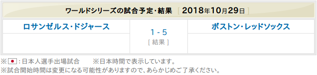
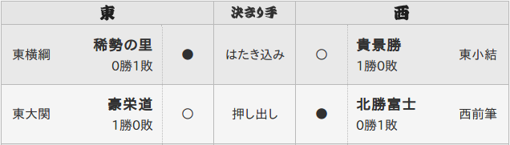

```{r setup, include=FALSE}
knitr::opts_chunk$set(echo = TRUE, message = FALSE, warning = FALSE)

require(DT)
require(tidyverse)
```


## 文字列操作
* なぜ文字列操作が必要なのか？
* 基本的な文字列操作
* 文字列操作パッケージ`stringr`
* 文字列を別の型に変換する
* より高度に処理するための正規表現
* 正規表現を用いた操作


## なぜ文字列操作が必要なのか？
スクレイピングで取得できるデータは表示を優先していることが多いため、読み込んだだけでは処理に不適当な。例えば [MLBの試合結果 <i class="fa fa-external-link"></i>](https://baseball.yahoo.co.jp/mlb/schedule/){target="_blank" title="Sportsnavi"} の場合、得点欄が複数行になっています。
<center>  </center>
　  
これをスクレイピングすると以下のようになり、得点欄をこのまま処理することはできません。  
```{r, echo=FALSE}
site_url <- "https://baseball.yahoo.co.jp/mlb/schedule/"
css_sel <- ".allstar > table:nth-child(1)"

(result <- site_url %>% 
  xml2::read_html() %>% 
  rvest::html_nodes(css = css_sel) %>% 
  rvest::html_table() %>% as.data.frame())
```


## 基本的な文字列操作
文字列を複数の列に分割するには`tidyr`パッケージが便利です。`tidry::separete`関数は`sep`パラメータに指定されているセパレータで文字列を分割する関数です。これを用いると先ほどのデータは以下のように分割できます。ただし、分割数はコーディング側で指定する必要があります。  
```{r}
result %>% 
  tidyr::separate(col = X2, into = c("X2_1", "X2_2", "X2_3"))
```


## 文字列操作パッケージ`stringr`
`tidyr::separete`関数で分割できない場合には文字列操作に特化した`stringr`パッケージが便利です。より細かな操作が可能になります。主な関数には以下のようなものがあります。  

function | description
---------|------------
`stringr::str_sub`  | 文字列を部分的に参照・変更する
`stringr::str_c`    | 複数の文字列を結合する
`stringr::str_split` | 文字列を分割する（返り値はリスト型）
`stringr::str_extract` | 指定したパターンにマッチした部分の文字列を取り出す
`stringr::str_replace` | 指定したパターンにマッチした部分のみ置換する


## 文字列を別の型に変換する
Rでは数字区切りがある数字や単位がついた数字は文字列データとして扱われます。このような場合、`readr`パッケージを用いると文字列を数値型（`intger`型や`double`型など）や論理型（`logical`型）に簡単に変換できます。  

function | description
---------|------------
`readr::parse_logical` | 「TRUE, FALSE」などを論理型に変換する
`readr::parse_integer` | 数字文字列を整数型に変換する
`readr::parse_double`  | 数字文字列を実数型に変換する
`readr::parse_number`  | 数字文字列を数値に変換する
`readr::parse_date`    | 数字文字列を日付型に変換する（`lubridate::as_date`と同様）


## より高度に処理するための正規表現（１／２）
文字列を高度に処理する場合に欠かせないのが正規表現です。Rでは拡張正規表現（POSIX 1003.2）が使えます。正規表現は、大雑把にいうとメタ文字と文字クラスを組み合わせてマッチする文字列を表現します。  

### メタ文字
メタ文字は特殊な意味を持つ文字で、その前にバックスラッシュを配置して利用します。メタ文字を利用することで様々な表現（どちらか、繰り返し、除く、など）が可能になります。  

### 文字クラス
文字クラスは`[`と`]`で挟まれた文字のリストで、リスト内のいずれの文字ともマッチするパターンを表現できます。  


## より高度に処理するための正規表現（２／２）
頻繁に使われるパターンは名前付き文字クラスと予め定義されています。代表的な名前付き文字クラスには以下のようなものがあります。  

regexp   | description
---------|------------
`[:alnum:]` | アルファベットと数値、[:alpha:] + [:digit:]
`[:alpha:]` | 大小文字アルファベット、 [:lower:] + [:upper:]
`[:digit:]` | 数値
`[:punct:]` | パンクチュエーション文字 ! " # $ % & ' ( ) * + , - . /
`[:space:]` | 空白文字、タブ、改行、水平タブ、給紙、キャリッジリターン、空白


## 正規表現を用いた操作
前述の正規表現を用いると`tidyr::extract`関数のような関数を用いてセパレータの代わりに正規表現を用いてより細かい操作が可能になります。  

```{r, eval=FALSE}
tidyr::extract(data, col, into, regex = "([[:alnum:]]+)", ...)
```

　  
このような関数は  [大相撲の取組表 <i class="fa fa-external-link"></i>](https://sports.yahoo.co.jp/sumo/torikumi/stats/?bashoId=201811){target="_blank" title="Sportsnavi"} のようなデータを処理するのに適しています。  

<center>  </center>


## 参照情報
* [tidyr <i class="fa fa-external-link"></i>](https://heavywatal.github.io/rstats/tidyr.html){target="_blank" title="Heavy Watal"}
* [readr <i class="fa fa-external-link"></i>](https://heavywatal.github.io/rstats/readr.html){target="_blank" title="Heavy Watal"}
* [stringr <i class="fa fa-external-link"></i>](https://heavywatal.github.io/rstats/stringr.html){target="_blank" title="Heavy Watal"}
* [Rにおける正規表現 <i class="fa fa-external-link"></i>](http://www.okadajp.org/RWiki/?R%20%E3%81%AB%E3%81%8A%E3%81%91%E3%82%8B%E6%AD%A3%E8%A6%8F%E8%A1%A8%E7%8F%BE){target="_blank" title="RjpWiki"}


## Enjoy!

CC BY-NC-SA 4.0, Sampo Suzuki