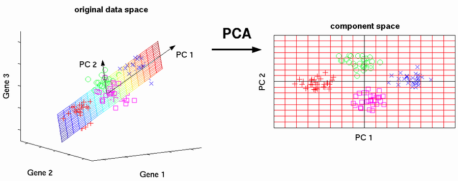
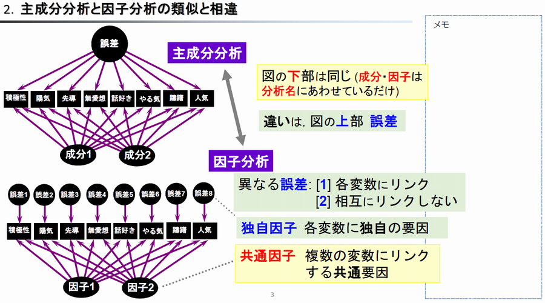

```{r setup, include=FALSE}
knitr::opts_chunk$set(echo = TRUE, message = FALSE, warning = FALSE)

require(tidyverse)
```

```{css, echo=FALSE}
/*見出しにアンダーラインを付加する。見出しごとにアンダーラインの太さを変える*/
h1 {
  border-bottom: solid 2.5px;
}

h2 {
  border-bottom: solid 2.0px;
}

h3 {
  /* border-bottom: solid 1.5px; */
  font-weight: bold;
}

h4 {
  border-bottom: solid 1.0px;     
}

/*太字をブルーのラインマーカー風にする*/
strong {
  background: linear-gradient(transparent 70%, #a7d6ff 60%)
}

/*太字をグリーンのラインマーカー風にする
strong {
  background: linear-gradient(transparent 70%, #66FFCC 60%);
}
*/

.caption {
  font-size: 75%;
}
```


## 本日の内容
1. 多変量解析入門
    * 多変量解析とは？
    * 予測や制御を行う
        * 重回帰分析
    * 集約や探索を行う
        * 主成分分析
        * 因子分析
1. 演習
    * 演習I ＆ 演習II, 演習III
    * レポート作成＆発表


# 多変量解析入門

## 多変量解析とは？
**多変量解析**（multivariate analysis）とは文字通り多数の変量（変数）を解析するための方法です。例えば、散布図行列では2変量間の関係は見えますが変量全体の関係はとらえにくいものです。変量全体の関係をとらえて**モデリング**したい場合やデータマイニングのように多数の情報から傾向を調べたい**探索**を行う場合などに多変量解析を用います。  

主な多変量解析の代表的な手法としては以下のようなものがあります。  

* 重回帰分析（予測や制御に使える）
    * 過去のデータが持つ構造が近い将来も使える（≒プロセスが安定している）
* 主成分分析（情報の縮約＝次元縮約）
* 因子分析（主成分分析とは似て非なるもの）
* クラスター分析（データの分類に便利）
* コンジョイント分析（上記の分析とは多少趣が異なる）


## 多変量解析の手法
多変量解析には前述のように様々な手法があり、目的に応じて使い分ける必要があります。  

1) 予測や制御  
線形単回帰のように**目的変数と説明変数の関係**を統計モデルとし、それに基づく予測を行いたい場合に用います

    * 連続データ：重回帰分析、分散分析
    * カテゴリカルデータ：判別分析、ロジスティク回帰分析

2) 集約や探索  
データが持つ情報を集約したり**変量の関係**を知りたい場合に用います。近年、データマイニングなどにも使われています。

    * 主成分分析、因子分析
    * クラスター分析（データを分類したい場合）


# 予測や制御を行う

## 変量（変数）間の関係
予測や制御を行う前には変量間の関係を把握しておくことが大切です。変量間の関係は以下のように分類できます。[出典：統計的因果推論 岩﨑学 朝倉書店]  

* **相関**関係（Correlation）
    * 関係性があることしか言えない（双方向の関係）
    * ゆえに予測や制御には使えない
* **回帰**関係（Regression）
    * 因果関係と同様な一方的な関係（必ずしも因果関係ではない）
    * 予測に用いることができる
        * 回帰関係と因果関係の違いがよく分からない...
* **因果**関係（Causality）
    * 原因から結果へ一方的な関係（回帰関係を因果関係としているものもある）
    * 予測や制御に用いることができる


## 単回帰分析（復習）
（線形）単回帰分析はひとつの説明変数と目的変数の関係を最小二乗法を用いて下記のような回帰式を求める分析です。最小二乗法を用いるため、ほとんどのデータで回帰分析ができてしまいますので、単回帰分析では精度（決定係数）が重要になります。  

$$y = a + bx$$

### 外挿
説明変数がない範囲（実際にデータが観察されていない範囲）は外挿と呼ばれ、回帰式が成り立つ関係があるのか分からないので注意が必要です。  

### 切片はどう考える？
例えば説明変数が規模の場合、切片（$説明変数 = 0$の時の目的変数の値）をどう考えるのが良いでしょうか？


## （線形）単回帰分析の結果を説明してください
```{r, echo=FALSE}
lm(mpg ~ hp, data = mtcars) %>% summary()
```


## 重回帰分析
（線形）重回帰分析では一般的に下記の回帰式（$n = 1, 2, ...$）を用います。

$$y = b_{0} + b_{1}x_{1} + b_{2}x_{2} + ... + b_{n}x_{n}$$

この回帰式を用いると以下のようなことができるようになります。  

* 説明変数（与えられた値）から目的変数を**予測**する
* 目的変数の値を大きく（または小さく）するには説明変数（これから与える値）をどうかするか（**制御**）【因果関係がある場合】

線形モデル以外にも、交互作用モデル、2次式モデル、共分散分析モデル、一般線形化モデルなど様々なモデルを作ることができます。

$$y = b_{0} + b_{1}x_{1} + ... + b_{n}x_{n} + b_{12}x_{1}x_{2} + ... + b_{(n-1)n}x_{n-1}x_{n}$$


## 重回帰式をどう評価するか
重回帰式の解釈や使い方は単回帰に比べると難しいと言われています。目的により解釈が変わってきますので注意してください。  

### 予測で使う場合（回帰関係）
* 個々の偏回帰係数の解釈はあまり重要でない
* 偏回帰係数はより良い予測モデルの選択のために用いられる

### 制御で使う場合（因果関係）
* 個々の偏回帰係数の解釈（値）が重要である
* 偏回帰係数は制御に用いるために選択される
    * 0に近いような係数は目的変数への影響が小さいので除外するなど


## 重回帰式の評価
（線形）重回帰モデルを評価するには線形単回帰モデルと同様に決定係数（自由度調整済み）とp値に着目します。  

### 自由度調整済み決定係数
```{r}
lm(mpg ~ cyl + disp + hp + drat + wt, data = mtcars) %>% broom::glance()
```
　  
**自由度調整済み決定係数**（adj.r.squared）は説明変数が目的変数の変動の何パーセントを説明できているかを意味する値です。この例では約$82\%$を説明できていることが分かります。予測に使う場合にはどの程度説明できているかは重要です。**p値**（p.value）は重回帰式自体の評価結果です。


## 重回帰式の評価（つづき）
重回帰式自体の評価を行ったら次に**偏回帰係数**のp値（p.value）を確認します。  

### 偏回帰係数とp値
```{r, eval=FALSE}
lm(mpg ~ cyl + disp + hp + drat + wt, data = mtcars) %>% broom::tidy()
```

```{r, echo=FALSE}
lm(mpg ~ cyl + disp + hp + drat + wt, data = mtcars) %>% broom::tidy() %>% 
  dplyr::mutate_if(is.double, round, digit = 3)
```


## 偏回帰係数の解釈
偏回帰係数の解釈は意外と難しくどの偏回帰係数を選ぶかは前述の目的（下記に再掲）により異なってきます。  

### 予測で使う場合（回帰関係）
* 個々の偏回帰係数の解釈はあまり重要でない
* 偏回帰係数はより良い予測モデルの選択のために用いられる

### 制御で使う場合（因果関係）
* 個々の偏回帰係数の解釈（値）が重要である
* 偏回帰係数は制御に用いるために選択される
    * 0に近いような係数は目的変数への影響が小さいので除外するなど


## 変数選択
説明変数の選択には**AIC（赤池情報量基準）**を元にしたステップワイズ変数選択を用いて最も適していると考えらえる変量を選択する方法があります。
```{r, include=FALSE}
result <- step(lm(mpg ~ cyl + disp + hp + drat + wt, data = mtcars)) %>%
  broom::tidy()
```

```{r, eval=FALSE}
step(lm(mpg ~ cyl + disp + hp + drat + wt, data = mtcars)) %>%
  broom::tidy()
```

```{r, echo=FALSE}
result %>% dplyr::mutate_if(is.double, round, digit = 3)
```

このモデル式では自由度調整済み決定係数が$0.8263$であり、先程のモデルよりは多くの変動を説明できているので予測に使うにはより適していると考えられます。


## 変数選択は意外と難しい
* 説明変数の選択は必要なのか？
    * 説明変数が決まっている
    * 分析の目的が予測（使えるものは使ってしまえ）
* 説明変数の選択が必要
    * 説明変数をスクリーニングしたい（分析の初期段階）
    * 予備調査の結果を用いて本調査を行う
    * 分析の目的が制御（少ない方が制御しやすい）

* ただし、残差分析は常に行うこと


## 残差分析
```{r, eval=FALSE}
lm(mpg ~ cyl + hp + wt, data = mtcars) %>% plot()
```

```{r, echo=FALSE}
par(mfrow=c(2, 2))
lm(mpg ~ cyl + hp + wt, data = mtcars) %>% plot()
par(mfrow=c(1, 1))
```


# 集約や探索を行う

## 主成分分析とは
主成分分析は次元縮約を使って任意数の変量（変数）から「共通因子」を探索し「可視化」できる分析方法です。乱暴にいえばｎ次元空間の変量（変数）の関係を２次元空間の主成分の関係へ写像する（次元縮約する）方法です。  




## 次元縮約とは
主成分分析や因子分析の目的である次元縮約とは多数ある変量をより少数の次元に要約することで変量の関係を把握しやすくするための手法です。次元縮約することで下表のようなことができるようになります。  

　 | 主成分分析     | 因子分析 
:-:|----------------|----------------
1  | 共通因子の探索 | 共通因子の探索
2  |　              | 独自要因の推定
3  | 重みつき合計   | 
4  | 可視化         | 


## 主成分分析の分析手順
主成分分析は以下の手順で行います。  

* ｎ次元空間の中で**最も分散が大きく**なる第一主成分軸を探す
* 第一主成分軸に**直行し最も分散が大きく**なる第二主成分軸を探す
* 第一、第二主成分軸に**直行し最も分散が大きく**なる第三主成分軸を探す
    * 以降、同様に第ｎ主成分軸までを探す
* 各主成分軸上での個々の変量（変数）の座標値（**主成分得点**）を求める
* 以下の指標を使用して主成分数を決める
    * 累積**分散説明率（寄与率）**（7〜8割以上ならまあいいかな）
    * 値が「1」を超える**（共分散の）固有値の数**
    * 降順に並べた（共分散の）固有値の折れ線の「**屈曲点** - 1」
        * 上記の値が一致しない場合は分析者の判断による


## 分散総和
主成分分析は各変量の分散を**分散の総和を変えず**に再分配する分析です。再分配する先を主成分（軸）と呼びます。以下のように総和に変化はありません。  

### 変量の分散総和と各変量の分散
```{r, echo=FALSE}
mtcars %>% dplyr::select(wt, qsec, am) %>% 
  dplyr::summarize_all(.funs = var, na.rm = TRUE) %>% 
  tidyr::gather(key, value) %>% 
  dplyr::mutate(sum = sum(value)) %>% 
  tidyr::spread(key, value) %>% 
  dplyr::select(sum, wt, qsec, am)
```

### 主成分得点の分散総和と主成分得点の分散
```{r, echo=FALSE}
mtcars %>% dplyr::select(wt, qsec, am) %>% 
  prcomp(scale. = FALSE) %>% broom::tidy() %>% 
  tidyr::spread(key = PC, value = value) %>% 
  dplyr::select(-row) %>% 
  dplyr::summarize_all(.funs = var, na.rm = TRUE) %>% 
  tidyr::gather(key, value) %>% 
  dplyr::mutate(sum = sum(value)) %>% 
  tidyr::spread(key, value) %>% 
  dplyr::rename(PC1 = `1`, PC2 = `2`, PC3 = `3`)
```


## 分散説明率（寄与率）
主成分数を決めるためにまず分散説明率を確認します。分散説明率とは分散の総和に対する各主成分得点の分散の比のことです。先程の例では下表の通りになります。

### 主成分得点の分散総和と主成分得点の分散
```{r, echo=FALSE}
mtcars %>% dplyr::select(wt, qsec, am) %>% 
  prcomp(scale. = FALSE) %>% broom::tidy() %>% 
  tidyr::spread(key = PC, value = value) %>% 
  dplyr::select(-row) %>% 
  dplyr::summarize_all(.funs = var, na.rm = TRUE) %>% 
  tidyr::gather(key, value) %>% 
  dplyr::mutate(sum = sum(value)) %>% 
  tidyr::spread(key, value) %>% 
  dplyr::rename(PC1 = `1`, PC2 = `2`, PC3 = `3`)
```

### 主成分得点の分散総和と分散説明率（寄与率）
```{r, echo=FALSE}
mtcars %>% dplyr::select(wt, qsec, am) %>% 
  prcomp(scale. = FALSE) %>% broom::tidy() %>% 
  tidyr::spread(key = PC, value = value) %>% 
  dplyr::select(-row) %>% 
  dplyr::summarize_all(.funs = var, na.rm = TRUE) %>% 
  tidyr::gather(key, value) %>% 
  dplyr::mutate(sum = sum(value)) %>% 
  tidyr::spread(key, value) %>% 
  dplyr::mutate(PC1 = `1`/sum, PC2 = `2`/sum, PC3 = `3`/sum) %>% 
  dplyr::select(sum, PC1, PC2, PC3)
```

この場合、第一、第二主成分得点で全体の$98\%$が説明できることが分かります。  


## （共分散行列の）固有値
分散共分散行列(相関係数行列)の固有値は主成分得点の標準偏差の二乗（主成分得点の分散）に等しく、固有値が1を超えているものを主成分として採用します。
```{r, echo=FALSE}
result <- mtcars %>% 
  dplyr::select(wt, qsec, am) %>% prcomp(scale. = FALSE)
```

### 固有値
```{r, echo=FALSE}
t(result$sdev ^ 2) %>% 
  as.data.frame() %>% dplyr::rename(PC1 = V1, PC2 = V2, PC3 = V3)
```


## 固有値の屈曲点
固有値を降順に並べて折れ線グラフを描き、屈曲点（変曲点）から1を引いたものが主成分数です。下記の場合は、3番目が屈曲点とみなせますので、主成分数は2となります。

```{r, echo=FALSE}
power_2 <- function (x) { return(x ^ 2) }

mtcars %>% 
  dplyr::select(wt, qsec, am, vs, gear) %>% 
  prcomp(scale. = FALSE) %>% 
  {power_2(.$sdev)} %>% t() %>% 
  as.data.frame() %>% 
  tidyr::gather("key", "value") %>% 
  tibble::rowid_to_column("rows") %>% 
  ggplot2::ggplot(ggplot2::aes(x = rows, y = value)) + 
    ggplot2::geom_line() + ggplot2::labs(x = "", y = "固有値") +
    ggplot2::geom_point(ggplot2::aes(x = 3, y = value[3]), colour = "red")
```


## 主成分分析の可視化
主成分得点を用いて可視化することでデータの関係を把握しやすくなります。二次元の可視化には`ggbiplot`関数が便利です。
```{r, echo=FALSE}
# iris %>% dplyr::select(-Species) %>% prcomp(scale. = FALSE) %>% 
#   ggbiplot::ggbiplot(obs.scale = 1, var.scale = 1, ellipse = FALSE,
#                      circle = TRUE, groups = as.factor(iris$Species))

mtcars %>% dplyr::select(wt, qsec, am) %>% prcomp(scale. = FALSE) %>% 
  ggbiplot::ggbiplot(obs.scale = 1, var.scale = 1, ellipse = FALSE,
                     circle = TRUE, groups = as.factor(mtcars$cyl))
```


## 単純構造化（より理解しやすくする）
以下の条件をすべて満たせば主成分負荷量を任意に変換（回転と呼ばれることが多い）することができます。

* 全ての主成分得点の**分散総和が「1」**
* 第k成分得点と第l成分得点（$\neq$k）は**無相関**
* **誤差の値を変えない**

回転させるのは主成分負荷量に「$0$」が多くなるようするためで、主成分負荷量が「$0$」（または、$0$に近い値）になれば、変量に対応する主成分は影響がない（少ない）ということであり、より、合理的な説明がしやすくなるからです。  

代表的な回転方法としてはバリマックス回転法があります。  


## Rで解くには
Rを利用して主成分分析を行うには`prcomp`関数を用います。数値データ以外は受け付けませんので注意してください。なお、`prcomp`関数の出力は**主成分得点**である点に注意してください（主成分負荷量ではありません）。  

```{r, eval=FALSE, include=FALSE}
mtcars %>% dplyr::select(wt, qsec, am) %>% 
  prcomp(scale. = TRUE)
```
```{r}
mtcars %>% dplyr::select(wt, qsec, am) %>% 
  prcomp(scale. = FALSE)
```


## 分散説明率（寄与率）を求める
分散説明率（寄与率）は`prcomp`関数の結果をサマライズするだけで求めることができます。  
```{r, eval=FALSE, include=FALSE}
mtcars %>% dplyr::select(wt, qsec, am) %>% 
  prcomp(scale. = TRUE) %>% summary()
```
```{r}
mtcars %>% dplyr::select(wt, qsec, am) %>% 
  prcomp(scale. = FALSE) %>% summary()
```

`Proportion of Variance`が分散説明率で、`Cumulative Proportion`が累積分散説明率になります。


## prcomp関数の返り値詳細
`prcomp`関数の返り値は下記のようなリスト型になっています。属性（`attr`）を見ると分かりますが与えたデータフレームの順に結果が返されます。
```{r, eval=FALSE, include=FALSE}
mtcars %>% dplyr::select(wt, qsec, am) %>% 
  prcomp(scale. = TRUE, retx = FALSE) %>% str()
```
```{r}
mtcars %>% dplyr::select(wt, qsec, am) %>% 
  prcomp(scale. = FALSE, retx = FALSE) %>% str()
```


## 固有値を求める
固有値は前述の通り主成分得点の標準偏差（`$sdev`）の二乗（=分散）に等しいので二乗することで求めることができます。
```{r}
result <- mtcars %>% dplyr::select(wt, qsec, am) %>% 
  # prcomp(scale. = TRUE)
  prcomp(scale. = FALSE)
```

```{r}
t(result$sdev ^ 2) %>% as.data.frame() %>% 
  dplyr::rename(PC1 = V1, PC2 = V2, PC3 = V3)
```

[参考資料 <i class="fa fa-external-link"></i>](http://kikkawa.cyber-ninja.jp/r/principal_component.html){target="_blank" title="主成分分析"}


## 主成分負荷量を求める
主成分負荷量は因子分析との関連から出てくることが多い**主成分得点と変量（変数）との相関係数**です。主成分得点（`$rotation`）と固有値の平方根（`$sdev`）の積で求めることができます。転置処理（`t`関数）が必要な点に注意してください。  
```{r, eval=FALSE, include=FALSE}
result <- mtcars %>% dplyr::select(wt, qsec, am) %>% 
  prcomp(scale. = TRUE)
t(t(result$rotation) * result$sdev) %>% as.data.frame()
```
```{r}
result <- mtcars %>% dplyr::select(wt, qsec, am) %>% 
  prcomp(scale. = FALSE)
t(t(result$rotation) * result$sdev) %>% as.data.frame()
```


## `prcomp`関数の`scale.`オプション
今回の説明では手動で計算した各変量の分散と主成分得点の分散が一致するように`prcomp`関数の`scale.`オプションは常に`FALSE`（デフォルト値）に設定していますが、一般的には`scale. = TRUE`を設定し各変量が単位分散を持つようにスケーリング^1^されることが推奨されています。

<div style="background-color:#f4f4ff; padding:10px 15px 15px 15px;">`scale.`  
a logical value indicating whether the variables should be scaled to have unit variance before the analysis takes place. **The default is FALSE** for consistency with S, **but in general scaling is advisable**. Alternatively, a vector of length
equal the number of columns of x can be supplied. The value is passed to base::scale function.</div>

　  
^1^ 各変量が異なる単位を持つ場合、標準化により無単位化（無次元化）すること


## 主成分分析のまとめ
* 多数の変量を**少数の主成分に縮約**する（まとめる）のが主成分分析
    * 今回の例では3変量が2変量に縮約された
    * 各変量の分散の総和と主成分の分散の総和は同じであることが条件
    * 分散の総和に占める割合（分散説明率）により主成分数が決まる
* 主成分の**解釈は分析者が行う**
    * 主成分が何を意味しているかは分析結果には示されない
    * 分析結果を可視化することで解釈しやすくなる

このような特徴から変量の多いアンケート分析などに使われることが多い主成分分析ですが、プロダクトメトリクスやチケットデータの分析にも使えるのではないかと考えています。ただし、チケットデータはカテゴリカルデータが多いので適用には工夫が必要だと思われます。


# 因子分析

## 因子分析とは
因子分析とは主成分分析と同様に変量を次元縮約することで共通要因を探索し**独自要因を推定する**ための分析方法です。主成分分析と異なるのは、誤差は各変量に固有のもの（各変量に独自の要因）として考える点です。なお、因子分析における共通因子とは主成分分析における主成分に同じです。  

<center></center>


## 主成分分析と因子分析




## Rで解くには
Rで因子分析を行うには最尤法を用いた`factanal`関数がありますが、今回は説明を省略します。「復習のためのリソース」などを参考にしてください。


# 演習

## 演習問題について
演習問題は以下の三問ですが、全てを解く必要はありません。また、今回の演習問題は計算をする問題ではなく各分析手法の結果を見て何が言えるかを話し合ってまとめてください。最後に発表していただきます。  


演習    | 概要                                                 | 分析手法
--------|------------------------------------------------------|------------
演習I   | バグの多いモジュールはどのような傾向があるかを考える | 主成分分析
演習II  | 成績上位の投手はどのような傾向があるかを考える       | 主成分分析
演習III | （独立）因子がなにを表しているかを考える             | 因子分析


# 演習I

## プロダクト・メトリクス
あるオブジェクト指向プログラムのプロダクト・メトリクス（ソースコード・メトリクス）を用いてバグが発見されたメソッド（モジュール）の特徴、バグが発見されていないメソッド（モジュール）の特徴を整理してみてください。なお、各メトリクスの意味は以下の通りです。  

　TMLOC: 総行数（総メソッド行数）  
　WMC: 重み付きメソッド数 - サイクロマチック複雑度の合計  
　CBO: クラス間の結合度 - 値が小さいほど結合度が弱い（作りがシンプル）  
　LCOM: クラスの凝集度の欠如 - 値が小さいほど凝集度が高い  
　RFC: 応答処理の多さ - 値が大きいほどメソッド呼び出しの種類が多い  
　  
データなど出典：デート本


## 主成分プロット
```{r, echo=FALSE}
"./data/code_metrics.csv" %>% 
  readr::read_csv(locale = readr::locale(encoding = "CP932")) %>% 
  dplyr::select(-Modify, -ModifyCount) %>% 
  prcomp(., scale. = TRUE) %>% 
  ggbiplot::ggbiplot(ellipse = TRUE, circle = TRUE)
```


## 主成分プロット（色分け）
```{r, echo=FALSE}
header <- "./data/code_metrics.csv" %>% 
  readr::read_csv(locale = readr::locale(encoding = "CP932")) %>% 
  dplyr::select(ModifyCount) %>% 
  tibble::rowid_to_column("row")

"./data/code_metrics.csv" %>% 
  readr::read_csv(locale = readr::locale(encoding = "CP932")) %>% 
  dplyr::select(-Modify, -ModifyCount) %>% 
  prcomp(., scale. = TRUE) %>% 
  broom::tidy() %>% 
  tidyr::spread(key = PC, value = value) %>% 
  dplyr::right_join(header, by = "row") %>% 
  dplyr::select(row, ModifyCount, PC1 = `1`, PC2 = `2`) %>% 
  dplyr::mutate(ModifyCount = as.factor(ModifyCount)) %>% 
  ggplot2::ggplot(ggplot2::aes(x = PC1, y = PC2, colour = ModifyCount)) + 
    ggplot2::geom_hline(ggplot2::aes(yintercept = 0)) +
    ggplot2::geom_vline(ggplot2::aes(xintercept = 0)) + 
    ggplot2::geom_point() + 
    ggplot2::scale_color_brewer(palette = "Accent")
```


# 演習 II

## 対象データ
対象となるデータは[セリーグの投手成績（最終結果）](http://npb.jp/bis/2018/stats/pit_c.html)です。成績には、総合、セーブ、ホールドポイントの三種類があります。次ページ以降の主成分分析結果を見て各投手がどのような特徴を持っているか分析してください。    

### セーブ
「セーブとは、リードしているチームの**救援投手**が試合終了までリードを守りきることで付く投手記録。最多のセーブを記録した投手に最多セーブ投手のタイトルが与えられる。」（ [Wikipedia <i class="fa fa-external-link"></i>](https://ja.wikipedia.org/wiki/%E3%82%BB%E3%83%BC%E3%83%96){target="_blank" title="セーブ"} より引用し修正）  

### ホールドポイント
「ホールドポイントとは、ホールドと救援勝利の数を合計した数字のことで2005年にセ・パ交流戦が始まったことに伴い、最優秀**中継ぎ投手**の新しい選考基準として考案された記録である。」（ [Wikipedia <i class="fa fa-external-link"></i>](https://ja.wikipedia.org/wiki/%E3%83%9B%E3%83%BC%E3%83%AB%E3%83%89#%E3%83%9B%E3%83%BC%E3%83%AB%E3%83%89%E3%83%9D%E3%82%A4%E3%83%B3%E3%83%88){target="_blank" title="ホールドポイント"} より引用し修正）

```{r, include=FALSE, eval=FALSE}

html_page <- "http://npb.jp/bis/2018/stats/pit_c.html" %>% 
  xml2::read_html()

df <- html_page %>%   
  # rvest::html_node(xpath = "/html/body/div/div/div/div[3]/table[1]") %>% 
  # rvest::html_node(xpath = "/html/body/div/div/div/div[3]/table[2]") %>% 
  rvest::html_node(xpath = "/html/body/div/div/div/div[3]/table[3]") %>%
  rvest::html_table() # %>% 
  # dplyr::slice(-1:-2)

df %>% 
  # readr::write_excel_csv("./data/cpitch_2018.csv")
  # readr::write_excel_csv("./data/cpitch_2018_s.csv")
  readr::write_excel_csv("./data/cpitch_2018_hp.csv")

rm(html_page, df)
```

```{r, echo=FALSE}
df_total <- "./data/cpitch_2018.csv" %>% 
  readr::read_csv(locale = locale(encoding = "UTF-8")) %>% 
  dplyr::select(-`ホール`) %>% 
  dplyr::mutate(`投手名` = stringr::str_remove(`投手名`, "[[:space:]]"))

df_save <- "./data/cpitch_2018_s.csv" %>% 
  readr::read_csv(locale = locale(encoding = "UTF-8")) %>% 
  dplyr::select(-`ホール`) %>% 
  dplyr::mutate(`投手名` = stringr::str_remove(`投手名`, "[[:space:]]"))

df_hp <- "./data/cpitch_2018_hp.csv" %>% 
  readr::read_csv(locale = locale(encoding = "UTF-8")) %>% 
  dplyr::select(-`ホール`) %>% 
  dplyr::mutate(`投手名` = stringr::str_remove(`投手名`, "[[:space:]]"))

df <- df_total %>% 
  dplyr::bind_rows(df_save, df_hp) %>% 
  tidyr::unite(col = "カテゴリ", `カテゴリ`, `順位`) %>% 
  tidyr::separate(`カテゴリ`, c("カテゴリ")) %>% 
  dplyr::mutate(`投手名` = stringr::str_remove(`投手名`, "[[:space:]]"))
```


# 総合成績

## 主成分分析表（総合成績）
```{r, echo=FALSE}
header <- df_total %>% 
  tibble::rowid_to_column("row") %>% 
  dplyr::select(row, `カテゴリ`, `投手名`, `チーム`)

df_total %>% 
  dplyr::select(-`カテゴリ`, -`投手名`, -`チーム`) %>% 
  prcomp(., scale. = TRUE) %>% 
  broom::tidy() %>% 
  tidyr::spread(key = PC, value = value) %>% 
  dplyr::mutate_if(is.double, round, digit = 4) %>% 
  dplyr::left_join(header, ., by = "row") %>% 
  dplyr::select(-row, -`カテゴリ`)
```


## 主成分分析結果（総合成績）
```{r, echo=FALSE}
# (df_total %>% 
#   dplyr::select(-`カテゴリ`, -`投手名`, -`チーム`) %>% 
#   prcomp(., scale. = TRUE)) %>% biplot()

header <- df_total %>% 
  tibble::rowid_to_column("row") %>% 
  dplyr::select(row, `カテゴリ`, `投手名`, `チーム`) %>% 
  dplyr::mutate(`投手名` = paste(row, `投手名`, sep = "_"))

df_total %>% 
  dplyr::select(-`カテゴリ`, -`投手名`, -`チーム`) %>% 
  prcomp(., scale. = TRUE) %>% 
  ggbiplot::ggbiplot(obs.scale = 1, var.scale = 1, ellipse = TRUE, circle = TRUE,
                     labels = header$投手名)
```


# セーブ上位

## 主成分分析表（セーブ上位）
```{r, echo=FALSE}
header <- df_save %>% 
  tibble::rowid_to_column("row") %>% 
  dplyr::select(row, `カテゴリ`, `投手名`, `チーム`)

df_save %>% 
  dplyr::select(-`カテゴリ`, -`投手名`, -`チーム`, -`セーブ`) %>% 
  dplyr::select(-`完投`, -`完封勝`, -`無四球`, -`ボーク`) %>% 
  prcomp(., scale. = TRUE) %>% 
  broom::tidy() %>% 
  tidyr::spread(key = PC, value = value) %>% 
  dplyr::mutate_if(is.double, round, digit = 4) %>% 
  dplyr::left_join(header, ., by = "row") %>% 
  dplyr::select(-row, -`カテゴリ`)
```


## 主成分分析結果（セーブ上位）
```{r, echo=FALSE}
header <- df_save %>% 
  tibble::rowid_to_column("row") %>% 
  dplyr::select(row, `カテゴリ`, `投手名`, `チーム`) %>% 
  dplyr::mutate(`投手名` = paste(row, `投手名`, sep = "_"))

df_save %>% 
  dplyr::select(-`カテゴリ`, -`投手名`, -`チーム`, -`セーブ`) %>% 
  dplyr::select(-`完投`, -`完封勝`, -`無四球`, -`ボーク`) %>% 
  prcomp(., scale. = TRUE) %>% 
  ggbiplot::ggbiplot(obs.scale = 1, var.scale = 1, ellipse = TRUE, circle = TRUE,
                     labels = header$投手名)
```


# ホールドポイント上位

## 主成分分析表（ホールドポイント上位）
```{r, echo=FALSE}
header <- df_hp %>% 
  tibble::rowid_to_column("row") %>% 
  dplyr::select(row, `カテゴリ`, `投手名`, `チーム`)

df_hp %>% 
  dplyr::select(-`カテゴリ`, -`投手名`, -`チーム`, -`HP`) %>% 
  dplyr::select(-`完投`, -`完封勝`, -`無四球`, -`ボーク`) %>% 
  prcomp(., scale. = TRUE) %>% 
  broom::tidy() %>% 
  tidyr::spread(key = PC, value = value) %>% 
  dplyr::mutate_if(is.double, round, digit = 4) %>% 
  dplyr::left_join(header, ., by = "row") %>% 
  dplyr::select(-row, -`カテゴリ`)
```


## 主成分分析結果（ホールドポイント上位）
```{r, echo=FALSE}
header <- df_hp %>% 
  tibble::rowid_to_column("row") %>% 
  dplyr::select(row, `カテゴリ`, `投手名`, `チーム`) %>% 
  dplyr::mutate(`投手名` = paste(row, `投手名`, sep = "_"))

df_hp %>% 
  dplyr::select(-`カテゴリ`, -`投手名`, -`チーム`, -`HP`) %>% 
  dplyr::select(-`完投`, -`完封勝`, -`無四球`, -`ボーク`) %>% 
  prcomp(., scale. = TRUE) %>% 
  ggbiplot::ggbiplot(obs.scale = 1, var.scale = 1, ellipse = TRUE, circle = TRUE,
                     labels = header$投手名)
```


# 総合、セーブ上位、ホールドポイント上位比較

## 主成分分析表
全てのカテゴリで比較するために「セーブ、HP、勝利、敗北、完投、完封勝」を除いた主成分分析結果です。
```{r, echo=FALSE}
header <- df %>% 
  tibble::rowid_to_column("row") %>% 
  dplyr::select(row, `カテゴリ`, `投手名`, `チーム`) # %>% 
  # dplyr::mutate(`投手名` = paste(`カテゴリ`, `投手名`, `チーム`, sep = "_"))

df %>% 
  dplyr::select(-`カテゴリ`, -`投手名`, -`チーム`, -`セーブ`, -`HP`) %>% 
  dplyr::select(-`勝利`, -`敗北`, -`完投`, -`完封勝`) %>% 
  prcomp(., scale. = TRUE) %>% 
  broom::tidy() %>% 
  tidyr::spread(key = PC, value = value) %>% 
  dplyr::mutate_if(is.double, round, digit = 4) %>% 
  dplyr::right_join(header, ., by = "row")
```


## 主成分プロット
```{r, echo=FALSE}
df %>% 
  dplyr::select(-`カテゴリ`, -`投手名`, -`チーム`, -`セーブ`, -`HP`) %>% 
  dplyr::select(-`勝利`, -`敗北`, -`完投`, -`完封勝`) %>% 
  prcomp(., scale. = TRUE) %>% 
  broom::tidy() %>% 
  tidyr::spread(key = PC, value = value) %>% 
  dplyr::right_join(header, by = "row") %>% 
  dplyr::select(row, `投手名`, `カテゴリ`, PC1 = `1`, PC2 = `2`) %>% 
  ggplot2::ggplot(ggplot2::aes(x = PC1, y = PC2, colour = `カテゴリ`)) + 
    ggplot2::geom_hline(ggplot2::aes(yintercept = 0)) +
    ggplot2::geom_vline(ggplot2::aes(xintercept = 0)) + 
    ggplot2::geom_point() +
    ggrepel::geom_text_repel(ggplot2::aes(label = row))
```


## 主成分プロット
```{r, echo=FALSE}
df %>% 
  dplyr::select(-`カテゴリ`, -`投手名`, -`チーム`, -`セーブ`, -`HP`) %>% 
  dplyr::select(-`勝利`, -`敗北`, -`完投`, -`完封勝`) %>% 
  prcomp(., scale. = TRUE) %>% 
  ggbiplot::ggbiplot(obs.scale = 1, var.scale = 1, ellipse = TRUE, circle = TRUE,
                     labels = header$row)
  # ggbiplot::ggbiplot(obs.scale = 1, var.scale = 1, ellipse = TRUE,
  #                    circle = TRUE) # +
  #   ggrepel::geom_text_repel(ggplot2::aes(label = header$`投手名`))
```


# 演習III

## 因子分析
[厚生労働省編一般職業適性検査 <i class="fa fa-external-link"></i>](https://www.jil.go.jp/institute/seika/tools/GATB.html){target="_blank" title="General Aptitude Test Battery: GATB"} の筆記試験結果を因子分析したグラフが次ページにあります。各独自因子がどのような適性（能力）なのか分析してください。

　  | 内容 | 　 | 内容
------|------|------|------
A | 円打点（円の中に点を打つ）　| G | 計算（加減乗除の計算を行う）
B | 記号記入（記号 を記入する） | H | 語意（同意語かまたは反意語を見つけだす）
C | 形態照合（形と大きさの同じ図形をさがしだす） | I | 立体図判断（展開図で表された立体形をさがしだす）
D | 名詞比較（文字・数字の違いを見つける） | J | 文章完成（文章を完成する）
E | 図柄照合（同じ図形を見つけだす） | K | 算数応用（応用問題を解く）
F | 平面図判断（置き方をかえた図形を見つけだす） | 


## 因子分析結果
```{r, echo=FALSE, fig.width=10}
GATB50_fa <- "./data/CATB50.csv" %>% 
  readr::read_csv(locale = readr::locale(encoding = "CP932")) %>% 
  dplyr::select(-X1) %>% 
  factanal(factors = 4, scores = "Bartlett")
  
GATB50_fa$loadings %>% as.data.frame.array() %>% 
  tibble::rownames_to_column("factor") %>% 
  tidyr::gather(key = "key", value = "value", -factor) %>% 
  ggplot2::ggplot(ggplot2::aes(x = factor, y = value, fill = factor)) + 
    ggplot2::facet_grid(. ~ key) + 
    ggplot2::geom_bar(stat = "identity") +
    ggplot2::labs(title = "GATB",
                  x = "変量（独立因子）", y = "因子負荷量") + 
    ggplot2::scale_fill_discrete(name = "",
      labels = c(A = "A 円打点検査", B = "B 記号記入", C = "C 形態照合",
                 D = "D 名詞比較", E = "E 図柄照合", F = "F 平面図判断",
                 G = "G 計算", H = "H 語意", I = "I 立体図判断",
                 J = "J 文章完成", K = "K 算数応用"))
```

[データなど出典 <i class="fa fa-external-link"></i>](https://www1.doshisha.ac.jp/~mjin/R/Chap_25/25.html){target="_blank" title="フリーソフトによるデータ解析・マイニング　第25回"}


# 最後に

## 復習のためのリソース

* [gacco （統計学IIIの開講予定は未定） <i class="fa fa-external-link"></i>](http://gacco.org/){target="_blank" title="無料で学べるオンライン大学講座"}
* [Rで主成分分析](https://www.casleyconsulting.co.jp/blog/engineer/119/){target="_blank" title="キャスレーコンサルティング"}
* [主成分分析とは <i class="fa fa-external-link"></i>](https://www.intage.co.jp/glossary/401/){target="_blank" title="株式会社インテージ"}
* [（Rを用いた）主成分分析 (PDF) <i class="fa fa-external-link"></i>](https://statistics.co.jp/reference/software_R/statR_9_principal.pdf){target="_blank" title="統計科学研究所"}

* [Rと主成分分析（同志社大学） <i class="fa fa-external-link"></i>](https://www1.doshisha.ac.jp/~mjin/R/Chap_24/24.html){target="_blank" title="フリーソフトによるデータ解析・マイニング　第24回"}
* [Rと因子分析 （同志社大学）<i class="fa fa-external-link"></i>](https://www1.doshisha.ac.jp/~mjin/R/Chap_25/25.html){target="_blank" title="フリーソフトによるデータ解析・マイニング　第25回"}


## Enjoy !

CC BY-NC-SA 4.0, Sampo Suzuki