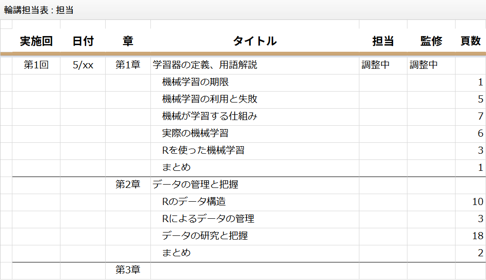
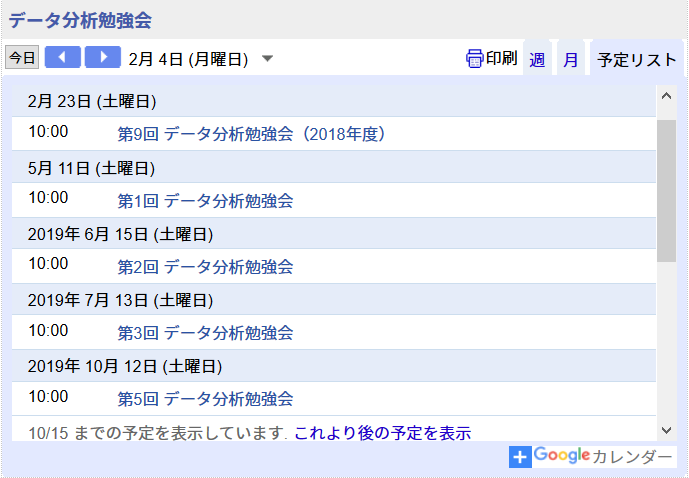

```{css, echo=FALSE}
/*太字をブルーのラインマーカー風にする*/
strong {
  background: linear-gradient(transparent 70%, #ffadad 75%);
}
```

```{r setup, include=FALSE}
knitr::opts_chunk$set(echo = TRUE, message = FALSE)

require(tidyverse)
```

# 来年度に向けて

## もくじ
* 来年度テーマと選定図書
* スケジュール案
* アンチハラスメントポリシー
* 運営に関して
    * 運営体制について
    * 勉強会サイトのモバイル端末対応
    * 管理用リソース
    * 連絡先の掲載

来年度へ向けて共通の認識を作っておきたい事項です。運営事務局内には既に展開していますが、ほぼ、個人的な主観で作成していますので、この場での意識合わせをしたいと考えています。


# 来年度テーマと選定図書

## 来年度テーマと選定図書
テーマ：Rではじめる機械学習  

近年増えているのが機械学習やディープラーニングなどのいわゆるAI（人工知能）技術を用いたソフトウェアです。このような新しいソフトウェアの品質を評価・保証するには、AI技術がどのような特徴を持っているのかを知っておく必要があります。そこで、今年度はAI技術のなかでも広く使われている機械学習について書籍**『Rによる機械学習』**を用いた輪講形式で基礎知識を学んでいきます。

### 選定理由
読者として以下を想定としており、**Rを使ってきた勉強会の経緯なども含めて**適していると判断しました。

* データを活用してアクションを起こしたい人
* 機械学習の知識は少しあるがRを使ったことはない人
* Rの知識は少しあるが機械学習を全く知らない人


## なぜRなのか？
[Six Reasons To Learn R For Business, R Blogger](https://www.r-bloggers.com/six-reasons-to-learn-r-for-business/){target="_blank"}

1. R Has The **Best Overall Qualities**
1. R Is Data Science **For Non-Computer Scientists**
1. **Learning R Is Easy** With The Tidyverse
1. R Has **Brains, Muscle, And Heart**
    * Cutting-edge algorithms and Powerful tools (packages)
1. R Is Built **For Business**
    * R Markdown
1. R **Community Support**


## なぜRなのか？（その２）
[統計言語 「R」のﾈ申はなぜ無償で貢献したのか <i class="fa fa-external-link"></i>](https://business.nikkeibp.co.jp/atcl/report/16/122700258/010900004/){target="_blank" title="日経ビジネス"}（日経ビジネス 「会社とは何か」 Hadley Wickhamへのインタビュー記事）より抜粋

　  
<div style="background-color:#f4f4ff; padding:10px 15px 15px 15px; font-size:smaller;">両者^1^に共通しているのは**データを扱うために言語や文法を定義**しているところです。目標はできるだけはっきり、簡単にコードで表現すること。どちらも**プロブラマー^2^でない人でもコードを書くことができます**。それを理解するために専門家になる必要もない。文章のようにコードを読み、もっと改善できるところを指摘し、そのコードを考えてシェアしていくことができるように設計しました。他の人が**何を理解しにくいと思うか、という心理的なことも考えて書いています**。</div>  
　  

^1^ `dplyr`パッケージと`ggplot2`パッケージのこと（総じて`tidyverse`の世界）  
^2^ 恐らく「プログラマー」の誤植


## なぜRなのか？（その３）
[統計言語 「R」のﾈ申はなぜ無償で貢献したのか <i class="fa fa-external-link"></i>](https://business.nikkeibp.co.jp/atcl/report/16/122700258/010900004/){target="_blank" title="日経ビジネス"}（日経ビジネス 「会社とは何か」 Hadley Wickhamへのインタビュー記事）より抜粋

　  
<div style="background-color:#f4f4ff; padding:10px 15px 15px 15px; font-size:smaller;">Rコミュニティでのやりとりの中で努力してきたことの一つは、できるだけ入ってきた人たちを**歓迎し、心地よい場所にする**^3^ということでした。Rを利用している人々はプログラマーではない人も多いですから、最初はとっつきにくい場合もあるでしょうし。（中略）世界中でフレンドリーなコミュニティが生まれてとてもうれしく思います。</div>  
　  

^3^ Slackコミュニティの [R-wakalang <i class="fa fa-external-link"></i>](https://qiita.com/uri/items/5583e91bb5301ed5a4ba){target="_blank" title="Qiita"} は、まさにこの精神で運用されいています（夏休みの宿題を質問しても答えてくれる）。


# スケジュール案

## 基本的な考え方
SQiP研究会の翌日開催が基本となるため全９回/年度の開催予定です。**全員参加を前提**として事前準備などの負担を加味し**60～90分/人/回**程度で１日最大４セッションとしてはどうでしょうか？

セッション数／日 | 担当時間 | 想定頁数／人 | 延べ人数 | 年間想定
-------------|---------:|-------------:|--------:|---:
２セッション | １２０分 | １０～１５頁 | １８名 | １８０～２７０頁
３セッション | 　８０分 | 　６～１０頁 | ２７名 | １６２～２７０頁
４セッション | 　６０分 | 　４～　８頁 | ３６名 | １４４～２８８頁

　  
参考：総ページ数「392」  
状況により適宜スケジュールを変更していく運用も視野に入れています。


## スケジュール管理案
詳細スケジュールに関しては管理の手間を考え勉強会アカウントのGoogleドキュメントを利用して管理・公開していく方法がベストだと考えます。



## 担当方法
輪講自体や機械学習に係わるのが初めてという方や体調不良など急な都合による欠席などを考慮し、特に初期段階においては１セッションあたり２人体制としてはどうでしょうか？  

担当者 | 役割など
-------|---
主担当 | メインで担当する
副担当 | 資料のレビューなど監修を担当する（主担当のバックアップ的なポジション）

　  
基本的には主担当の方による輪講になりますが、状況に応じて副担当の方がサポートしたり輪講を担当したりすることを想定しています。具体的な担当方法は希望制、重複した場合はガチャというイメージで考えています。


# アンチハラスメントポリシー

## アンチハラスメントポリシーの制定
以前に運営メンバーのみに提案ていましたが、参加者が多様になってくると今までの比較的親しい仲間内で共有できていた価値観や暗黙の了解が理解・共有されず、様々な軋轢や衝突を生じる可能性が高くなります。そこで、軋轢や衝突を生じることなく**楽しく参加できる場を保つ**ためにポリシーを制定しご理解して頂いた上で、参加していただくことが必要なのではと考えます。  
　  
このようなアンチハラスメントポリシーは日本国内では恐らくRuby25周年イベントで制定されたのが最初で、参加者が急激に増えたTokyo.Rでも制定されています。  
　  
「アンチハラスメントポリシー」という言い方がきつく感じる場合には「コミュニティポリシー」として全体の方針の中の一項目と位置付けてもいいかと思います。  

なお、ポリシーの掲載に伴い連絡先を公開する必要があります。


## アンチハラスメントポリシー（案）
<div style="background-color:#f4f4ff; padding:10px 15px 15px 15px;">
ハラスメント行為とは以下の言動・表現を含みます。  
　・性差、性同一性、性的指向、障碍、容貌、体型、人種、民族、年齢、宗教あるいは無宗教に対する攻撃的な言動および表現  
　・公共の場での性的な画像や類する表現  
　・脅迫、ストーキング、不適切な（身体）接触、または、それらの計画  
　・望まない写真撮影や録音、録画  
　・上記のような行為の推奨・養護  
　  
運営メンバーを含む全ての参加者は、運営者からハラスメント行為を止めるように求められた場合、直ちにしたがわなければなりません。したがわない場合、運営者は、適切と思われる範囲で警告・強制的な退席・コミュニティからの追放などの手段を行使します。会場内での言動だけでなく、ブログやSNSなどで公開、コメントなどいただく際にも、これらハラスメント行為がないようご留意ください。ハラスメント行為を見聞きした・被害にあわれた方は、下記の窓口もしくは会場の運営スタッフまでご連絡ください。  
</div>


# 運営に関して

## 運営体制について
既にご存知かと思われますが、主催のK池さんが韓流アイドルにうつつを抜かすため来年度の運営は運営事務局主体となります。  
　  
ご異存なければ、現在の運営事務局メンバーにて運営させていただきます。


## 勉強会サイトのモバイル端末対応
2019年度はbit & innovationとのコラボレーションでスタートアップ企業の参加者を取り込むためにポスター掲示などの施策を実施しますが、ポスターを見た方がその場で勉強会サイトを見ることを考えると**勉強会サイトのモバイル端末対応（スマフォ、タブレット用表示）が必要**と考えています。なお、講義資料のモバイル端末対応は対象外です。  

また、勉強会サイトを公開に利用してるGoogleサイトが新たなGoogleサイト（以降、新サイト）に移行しており、より強化されたモバイル端末対応が実現できるようになっています。現行のサイト（以降、現行サイト）を新サイトへ変換することも可能ですが、過去の経緯やアップされている資料を考えると現行サイトが存続できるようにしておく必要があると考えています。  

そこで、Googleサイトをどのようにするのがベストなのかを以降で提案します。


## 提案（推奨する結論）
* **現行サイトは変換しない**（新サイトを利用しない）
    * モバイル端末用に最適化した表示に変換してくれる
        * スマフォとFirefoxのUserAgent Switcherでは表示確認済
        * UIとしては新サイトの方に分があるが表示変換でも困らない
        * 画面幅の狭いPCなどでは最適化した表示に変換されない
    * 現状70ページ超のページが存在するため変換後の修正が大掛かり
        * 変換の制限については次ページ以降を参照方
    * 現行サイトでもウィジェットの埋め込みは可能
        * カレンダー、マップ、ドキュメントどれも可
* 新サイトを作成する場合
    * 単一アカウントで旧新サイトの混在管理が可能かどうかを調べる必要あり


## 管理用リソース
勉強会のスケジュール管理については更新の手間を最小限にするためにGoogleカレンダーならびにGoogleドキュメントをリソースとして利用し、基本的に運営事務局メンバーのみが編集できるような設定にすることを考えています。  




## 連絡先の掲載
今までサイトで明示してこなかった連絡先については、スタートアップ企業とのコラボレーションを考えると明示が必要と考えます。ただし、単純に`mailto:`リンクをはるとスパムメールの餌食になるので工夫が必要です。  

### 明示方法
* 運営用のメールアドレスを公開する
    * 全角文字を使うベタな方法でリンク作成
* こくちーずPROの問い合わせ機能を使う（イベント単位でしか機能しない）
    * Webフォーム型なのでメールアドレスを公開する必要なし
        * 問い合わせる人は連絡先を入力する必要あり（直接返信できない）
* Twitterアカウントを公開する
    * メアドや本名を公開するのに抵抗がある方に受入られやすいらしい


# 参考資料

## 参考）Ruby25のアンチハラスメントポリシー（抜粋）
<div style="background-color:#f4f4ff; padding:10px 15px 15px 15px;">
ハラスメントには以下のようなものを含み、また、これに限りません。  
　  
・ジェンダー、性自認やジェンダー表現、性的指向、障碍、容貌、体型、人種、民族、年齢、宗教あるいは無宗教についての攻撃的なコメントをすること。  
・公共のスペースで性的な画像を掲示すること。  
・脅迫、ストーキング、つきまとい、または、それらを計画すること。  
・いやがらせ目的の撮影や録音。  
・発表や他のイベントを継続的に妨害すること。  
・不適切な身体的接触。  
・不快な性的アトラクション。  
・以上のような行為を推奨したり、擁護したりすること。  
　  
ハラスメント行為をやめるように要請された参加者は、直ちに従ってください。
</div>


## 参考）Tokyo.Rのアンチハラスメントポリシー
<div style="background-color:#f4f4ff; padding:10px 15px 15px 15px;">
ハラスメント行為とは、以下の言動・表現を含みます。  
・性差、性同一性、性的嗜好、障がい、外見や身体的特徴、人権、宗教に対する攻撃的な言動および表現  
・公共の場での性的な画像や類する表現  
・脅迫、ストーカ、不適切な接触  
・**望まない写真撮影や録音、録画**  
　  
全ての参加者（スポンサ及び運営メンバを含む）は、Tokyo.R運営チームからハラスメント行為を止めるように求められた場合、直ちに従わなければなりません。従わない場合、運営チームは、適切と思われる範囲で警告・強制的な退席・コミュニティからの追放などの手段を行使します。  
会場内での言動だけでなく、Tokyo.Rの内容や状況についてブログやSNSなどで公開、コメントなどいただく際にも、これらハラスメント行為がないようご留意ください。ハラスメント行為を見聞きした・被害にあわれた方は、下記の窓口もしくは会場の運営スタッフまでご連絡ください。
</div>


## 参考）Googleサイト比較
　           | 現行サイト                     | 新サイト
-------------|--------------------------------|------------------------
モバイル対応 | 可（モバイル端末用に自動調整） | 可（マルチサイズ対応）
アクセス権管理 | 可（オーナー、編集者、閲覧者） | 可（現行サイトと同等）
作成方法     | テキストベース                 | オブジェクト配置ベース
プレビュー   | 不可（保存即公開）             | 可（公開停止も可）
テーマ       | 50種類超（カスタム可能）       | 6種類（カスタム可能）
レイアウト   | 固定9種                        | フリー（サンプル6種）
表組         | 可（GUIで作成可能）            | 可（HTMLコードを張り付け）
ガジェット配置 | 可（新サイトと同レベル）     | 可（Googleアプリの利用前提） 


## 参考）[詳細比較](https://support.google.com/sites/answer/7176163?hl=ja)
　           | 現行サイト                     | 新サイト
-------------|--------------------------------|------------------------
テンプレート | 任意テンプレート指定可能       | 利用不可
サブページ   | 無制限                         | 最大5階層
権限指定     | ページ単位で可能               | サイト単位のみ
コメント     | ページ単位でコメント可能       | コメント不可能
保存容量     | 最大100MB                      | Googleドライブ依存（GB単位）


## 参考）[変換時の注意](https://support.google.com/sites/answer/9014016?hl=ja&ref_topic=6372873)
　           | 想定される動作など（主に制限となる事項） | 備考
-------------|----------------------------------------|---
レイアウト   | 崩れる可能性あり                       | 
テーマ       | 新テーマに変換                         | 
テキスト書式 | フォントの色やサイズが反映されない     | 対象多
サブページ   | 5階層を超えるものは5階層目に配置される | 対象なし
添付ファイル | Googleドライブフォルダとして各ページに埋め込み | 対象他
コメント、履歴 | 引き継がれない                       | 多少あり
オーナー     | 一人のみ（変換者がオーナーになり編集者指定は可能） | オーナー複数


## 参考）イメージ（PC現行サイト）
<center></center>


## 参考）イメージ（PC新サイト）
<center></center>


## 参考）イメージ比較（狭幅PC）
現行サイトは２カラムレイアウトのまま、新サイトはカラムを自動調整。

<center></center>


## 参考）イメージ比較（スマフォ）
現行サイトも新サイトも同様なイメージで調整される。

<center></center>

