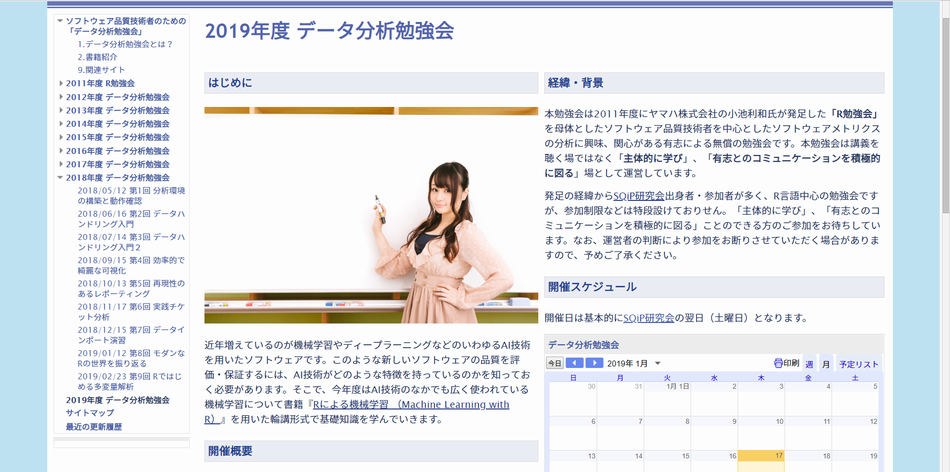
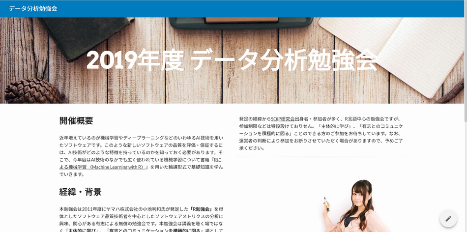
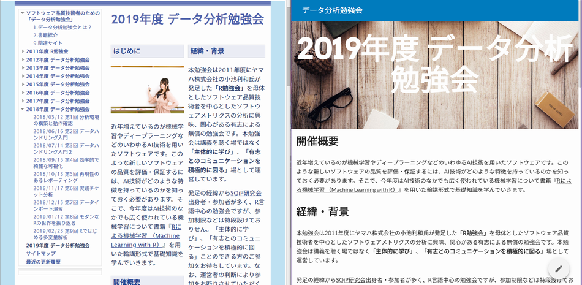
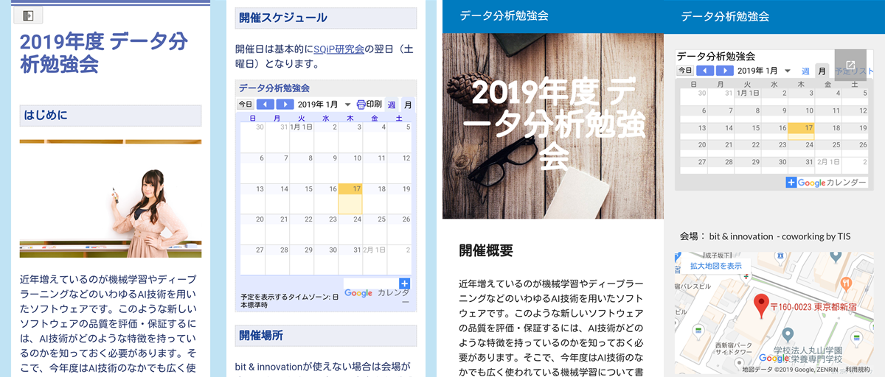

```{r setup, include=FALSE}
knitr::opts_chunk$set(echo = TRUE, message = FALSE)

require(tidyverse)
```


# 来年度勉強会について

## テーマと目標（案）

テーマ：Rではじめる機械学習  
目　標：  
　  
近年増えているのが機械学習やディープラーニングなどのいわゆるAI技術を用いたソフトウェアです。このような新しいソフトウェアの品質を評価・保証するには、AI技術がどのような特徴を持っているのかを知っておく必要があります。そこで、今年度はAI技術のなかでも広く使われている機械学習について書籍『Rによる機械学習 （Machine Learning with R）』を用いた輪講形式で基礎知識を学んでいきます。


# 勉強会サイトについて

## 勉強会サイトの移行について
2019年度はbit & innovationとのコラボレーションでスタートアップ企業の参加者を取り込むためにポスター掲示などの施策を実施しますが、ポスターを見た方がその場で勉強会サイトを見ることを考えると**勉強会サイトのモバイル対応（スマフォ、タブレット用表示）も必要**と考えています。ただ、過去の経緯やアップされている資料を考えると現行サイトを存続させる必要もあると思います。そこで、以下の点についての意見交換を行い方針を決めたいと思います。  

* モバイル対応の是非
* 新サイトへの移行の是非
    * 現行サイトを新サイトへ変換可能なことは確認済
    * ただ、変換するとどうなるかが分からない...
        * 変換前に添付ファイルは移動させておく必要あり〼
* 記載内容の見直し・追加
    * アンチ・ハラスメントポリシーなど


# モバイル対応と新サイトへの移行

## Googleサイト比較
　           | 現行サイト                     | 新サイト
-------------|--------------------------------|------------------------
モバイル対応 | 可（モバイル端末用に自動調整） | 可（マルチサイズ対応）
アクセス権管理 | 可（オーナー、編集者、閲覧者） | 可（現行サイトと同等）
作成方法     | テキストベース                 | オブジェクト配置ベース
プレビュー   | 不可（保存即公開）             | 可（公開停止も可）
テーマ       | 50種類超（カスタム可能）       | 6種類（カスタム可能）
レイアウト   | 固定9種                        | フリー（サンプル6種）
表組         | 可（GUIで作成可能）            | 可（HTMLコードを張り付け）
ガジェット配置 | 可（新サイトと同レベル）     | 可（Googleアプリの利用前提） 


## イメージ（PC現行サイト）
<center></center>


## イメージ（PC新サイト）
<center></center>


## イメージ比較（狭幅PC）
現行サイトは２カラムレイアウトのまま、新サイトはカラムを自動調整。

<center></center>


## イメージ比較（スマフォ）
現行サイトも新サイトも同様なイメージで調整される。

<center></center>


# 記載内容の見直し

## アンチ・ハラスメントポリシーの制定
以前に運営メンバーのみに提案しましたが、参加者が多様になってくると今まで比較的親しい仲間内で共有できていた価値観や暗黙の了解が理解・共有されず、様々な軋轢や衝突を生じる可能性が高くなります。そこで、軋轢や衝突を生じることなく**楽しく参加できる場を保つ**ためにポリシーを制定しご理解して頂いた上で、参加していただくことが必要なのではと考えます。  
　  
このようなアンチ・ハラスメントポリシーは日本国内では恐らくRuby25周年イベントで制定されたのが最初で、参加者が急激に増えたTokyo.Rでも制定されています。


## Ruby25の例（抜粋）
<div style="background-color:#f4f4ff; padding:10px 15px 15px 15px;">
ハラスメントには以下のようなものを含み、また、これに限りません。  
　  
・ジェンダー、性自認やジェンダー表現、性的指向、障碍、容貌、体型、人種、民族、年齢、宗教あるいは無宗教についての攻撃的なコメントをすること。  
・公共のスペースで性的な画像を掲示すること。  
・脅迫、ストーキング、つきまとい、または、それらを計画すること。
・いやがらせ目的の撮影や録音。  
・発表や他のイベントを継続的に妨害すること。  
・不適切な身体的接触。  
・不快な性的アトラクション。  
・以上のような行為を推奨したり、擁護したりすること。  
　  
ハラスメント行為をやめるように要請された参加者は、直ちに従ってください。
</div>


## Tokyo.Rの例
<div style="background-color:#f4f4ff; padding:10px 15px 15px 15px;">
ハラスメント行為とは、以下の言動・表現を含みます。  
・性差、性同一性、性的嗜好、障がい、外見や身体的特徴、人権、宗教に対する攻撃的な言動および表現  
・公共の場での性的な画像や類する表現  
・脅迫、ストーカ、不適切な接触  
・望まない写真撮影や録音、録画  
　  
全ての参加者（スポンサ及び運営メンバを含む）は、Tokyo.R運営チームからハラスメント行為を止めるように求められた場合、直ちに従わなければなりません。従わない場合、運営チームは、適切と思われる範囲で警告・強制的な退席・コミュニティからの追放などの手段を行使します。  
会場内での言動だけでなく、Tokyo.Rの内容や状況についてブログやSNSなどで公開、コメントなどいただく際にも、これらハラスメント行為がないようご留意ください。  
ハラスメント行為を見聞きした・被害にあわれた方は、下記の窓口もしくは会場の運営スタッフまでご連絡ください。
</div>


## アンチ・ハラスメントポリシー（案）
<div style="background-color:#f4f4ff; padding:10px 15px 15px 15px;">
ハラスメント行為とは以下の言動・表現を含みます。  
　・性差、性同一性、性的指向、障碍、容貌、体型、人種、民族、年齢、宗教あるいは無宗教に対する攻撃的な言動および表現  
　・公共の場での性的な画像や類する表現  
　・脅迫、ストーキング、不適切な（身体）接触、または、それらの計画  
　・いやがらせ、または、望まない写真撮影や録音、録画  
　・上記のような行為の推奨・養護
運営メンバーを含む全ての参加者は、運営者からハラスメント行為を止めるように求められた場合、直ちにしたがわなければなりません。したがわない場合、運営者は、適切と思われる範囲で警告・強制的な退席・コミュニティからの追放などの手段を行使します。  
会場内での言動だけでなく、ブログやSNSなどで公開、コメントなどいただく際にも、これらハラスメント行為がないようご留意ください。  
ハラスメント行為を見聞きした・被害にあわれた方は、下記の窓口もしくは会場の運営スタッフまでご連絡ください。  
連絡先：
</div>


# その他

## その他の事項

### サイトレイアウト
現行サイトではTopの配下に各年度のページを作成していますが、現行のTopをSQiP以外で前面に出すと「ソフトウェア品質技術者ってなに？」的な違和感を与える可能性があるため、来年度からは年度のページTopを前面に出すようにしてはどうでしょうか？  

### 連絡先
現在、勉強会サイトでは連絡先は非公開ですが、スタートアップに門戸を広げたり、アンチ・ハラスメントポリシーを掲示するとなると連絡先を公開する必要があります。ただし、単純にメールアドレスをリンクするとスパムメール業者の餌食になりますので「@を大文字やat」に変えるなどの工夫が必要です。